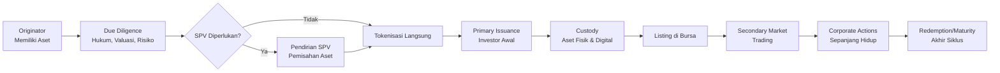
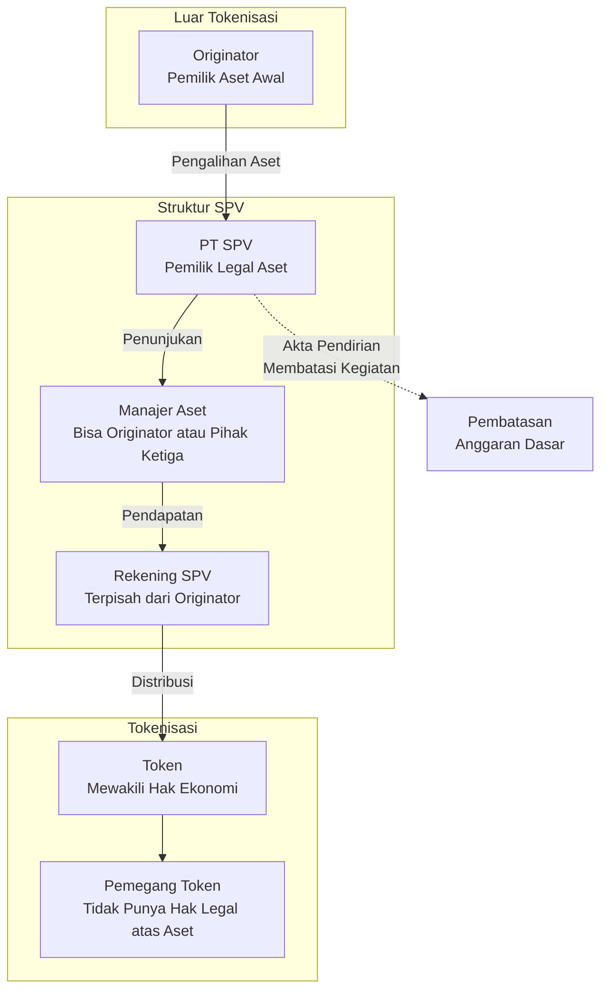
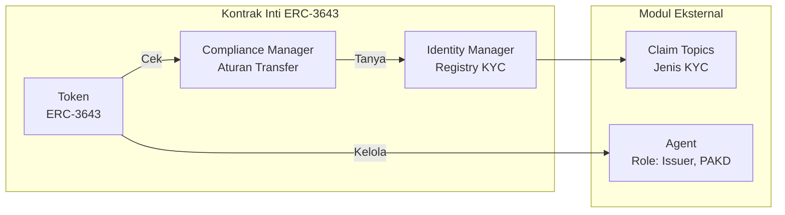
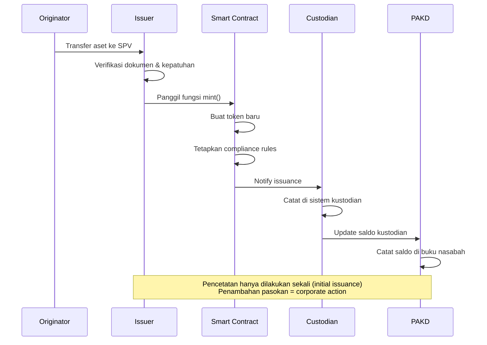
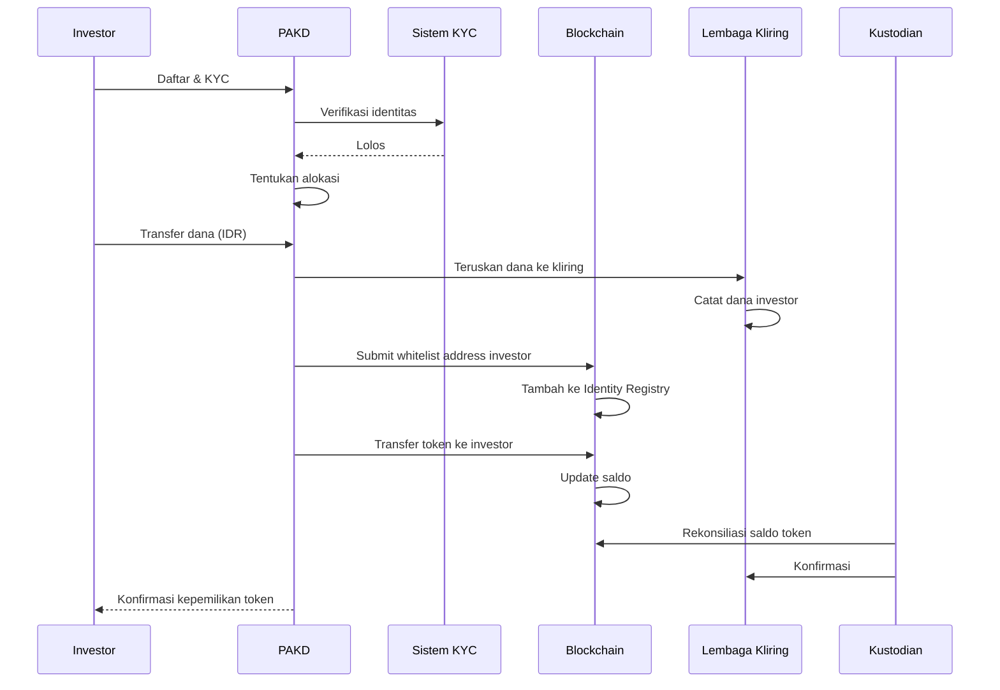
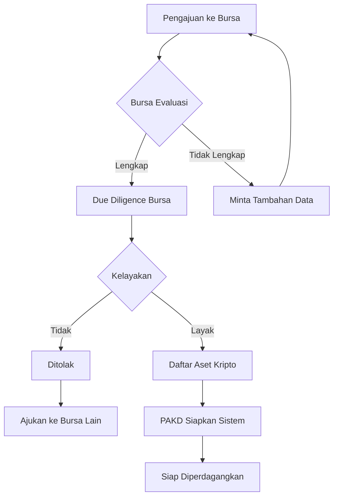
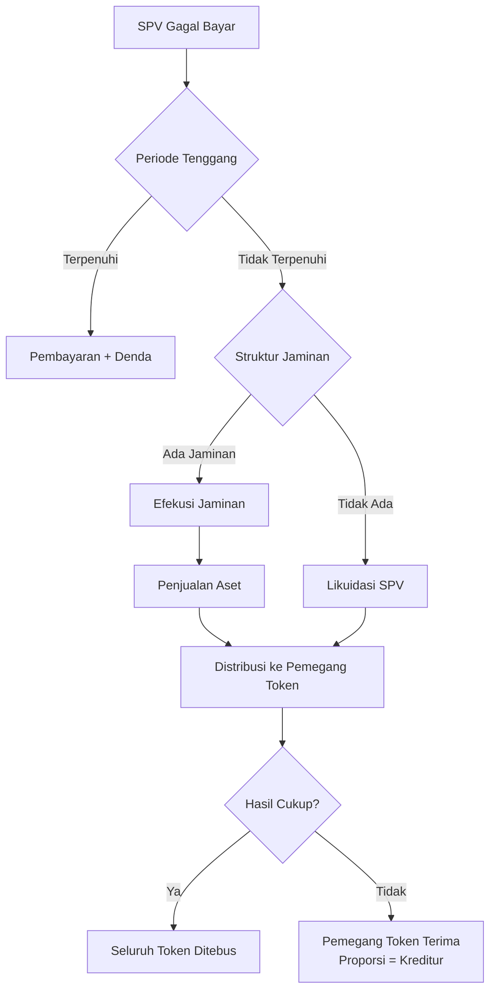
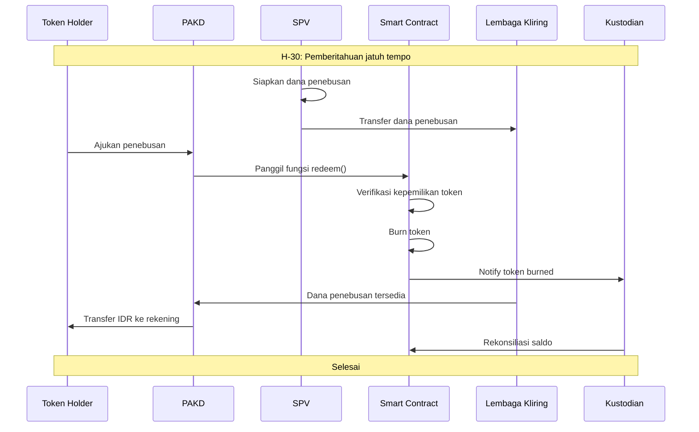
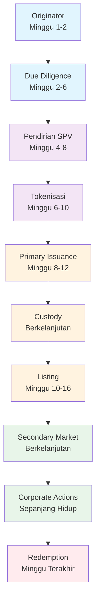

# Siklus Hidup Tokenisasi Aset Dunia Nyata (RWA)

Dokumen ini menjelaskan secara kronologis seluruh perjalanan sebuah aset dunia nyata (*Real World Asset* / RWA) dari saat aset diidentifikasi hingga token ditebus atau dimusnahkan. Setiap langkah dijelaskan dari perspektif pendiri perusahaan tokenisasi yang pada akhirnya akan berinteraksi dengan OJK, bursa, lembaga kliring, kustodian, bank, auditor, dan investor institusional.

Bab ini mengasumsikan pembaca telah memahami infrastruktur pasar yang dijelaskan dalam Bab 03 — termasuk peran PAKD, bursa (CFX dan ICEX), lembaga kliring, kustodian, dan kerangka pengawasan OJK.



---

## 1. Originator Aset

### Siapa Originator?

Originator adalah entitas yang memiliki aset dunia nyata dan ingin mentokenisasi aset tersebut. Dalam konteks Indonesia, originator dapat berupa:

- **Perusahaan properti** — pemilik gedung perkantoran, pusat perbelanjaan, hotel, atau tanah kawasan industri.
- **Korporasi infrastruktur** — pemilik jalan tol, jaringan telekomunikasi, pembangkit listrik, atau pelabuhan.
- **Lembaga keuangan** — bank atau perusahaan pembiayaan yang memiliki portofolio piutang.
- **Pemerintah daerah** — pemilik aset daerah seperti pasar, terminal, atau gedung serbaguna (dengan persetujuan Menteri Dalam Negeri sesuai PP 27/2014).
- **BUMN/BUMD** — aset negara yang dapat dikomersialkan melalui skema *asset recycling*.

### Mengapa Tokenisasi?

Originator memilih tokenisasi bukan karena teknologi blokir rantai — melainkan karena tokenisasi menyelesaikan masalah bisnis:

| Masalah | Solusi Tokenisasi |
|---------|-------------------|
| Aset bernilai besar (Rp500 miliar+) sulit dijual sebagian | Fraksionalisasi: token memungkinkan kepemilikan parsial |
| Pendanaan perbankan terbatas oleh BMPK (Batas Maksimum Pemberian Kredit) | Akses ke pasar modal digital — basis investor lebih luas |
| Proses sekuritisasi konvensional mahal (underwriter, rating, prospectus) | Penerbitan token lebih efisien secara biaya operasional |
| Aset tidak likuid — butuh waktu berbulan-bulan untuk menjual | Likuiditas sekunder di bursa aset digital |
| Investor asing sulit berpartisipasi karena hambatan geografis | Token dapat diakses oleh PAKD terdaftar lintas wilayah |

### Insentif Originator

Originator mendapatkan beberapa insentif spesifik:

1. **Pembiayaan tanpa utang langsung.** Tokenisasi bukan pinjaman. Originator menjual hak ekonomi atas aset tanpa menambah liabilitas di neraca (tergantung struktur — lihat Seksi 3 tentang SPV).
2. **Biaya modal lebih rendah.** Jika aset memiliki kualitas tinggi (gedung grade A dengan penyewa korporasi), imbal hasil token dapat lebih rendah dari bunga bank.
3. **Kecepatan.** Penerbitan token dapat diselesaikan dalam hitungan minggu dibandingkan sekuritisasi tradisional yang membutuhkan 6–12 bulan.
4. **Retensi kendali operasional.** Originator dapat tetap menjadi pengelola aset (*asset manager*) dengan imbalan manajemen tahunan.
5. **Diversifikasi sumber pendanaan.** Tidak bergantung pada satu bank sindikasi.

### Risiko Originator

- **Risiko reputasi.** Jika aset gagal menghasilkan imbal hasil, originator menghadapi tekanan dari ribuan pemegang token.
- **Risiko regulasi.** Kerangka hukum tokenisasi RWA di Indonesia masih berkembang. Perubahan kebijakan OJK dapat mempengaruhi struktur yang sudah berjalan.
- **Risiko struktural.** Originator harus memisahkan aset dari kepemilikan pribadi — kehilangan fleksibilitas untuk menjaminkan aset ke bank.

Dokumen yang diperlukan pada tahap ini: bukti kepemilikan aset, laporan keuangan originator, profil manajemen, dan pernyataan minat untuk melakukan tokenisasi.

---

## 2. Uji Tuntas Aset (*Asset Due Diligence*)

Setelah originator menyatakan minat, langkah pertama yang sebenarnya — sebelum kode apa pun ditulis — adalah uji tuntas menyeluruh. Tahap ini menentukan apakah aset layak ditokenisasi dan bagaimana strukturnya.

### Pemeriksaan Kepemilikan Hukum

Tim hukum — sebaiknya kantor hukum yang terdaftar di OJK atau memiliki pengalaman di pasar modal — melakukan pemeriksaan:

- **Sertifikat kepemilikan.** Untuk tanah dan bangunan: SHM (Sertifikat Hak Milik), SHGB (Sertifikat Hak Guna Bangunan), atau HPL (Hak Pengelolaan). Untuk aset bergerak: BPKB, akta kepemilikan.
- **Rantai kepemilikan (*chain of title*).** Riwayat peralihan hak minimal 20 tahun ke belakang atau sejak penerbitan sertifikat pertama.
- **Beban dan jaminan.** Apakah aset sedang dijaminkan ke bank? Apakah ada hak tanggungan, fidusia, atau *cross-collateral*?
- **Izin-izin terkait.** IMB (Izin Mendirikan Bangunan), PBG (Persetujuan Bangunan Gedung — menggantikan IMB sejak UU Cipta Kerja), SLF (Sertifikat Laik Fungsi), AMDAL, UKL-UPL.
- **Sengketa.** Apakah aset sedang dalam sengketa di pengadilan? Apakah ada gugatan pihak ketiga?
- **Perjanjian sewa.** Jika aset menghasilkan pendapatan sewa, seluruh perjanjian sewa harus diperiksa — termasuk jangka waktu, opsi perpanjangan, dan hak *first refusal* penyewa.

**Siapa yang melakukan:** Kantor hukum (*legal counsel*) yang ditunjuk oleh penerbit (*issuer*).
**Siapa yang mengawasi:** OJK dapat meminta bukti uji tuntas sebagai bagian dari proses persetujuan instrumen.
**Dokumen keluaran:** *Legal opinion* (pendapat hukum) yang menyatakan bahwa aset bebas dari sengketa dan siap dialihkan.

### Valuasi

Valuasi dilakukan oleh KJPP (Kantor Jasa Penilai Publik) yang terdaftar di OJK — sama seperti yang dipersyaratkan untuk reksa dana dan EBA di pasar modal Indonesia.

- **Metode pendapatan (*income approach*)** — diskonto arus kas masa depan (DCF). Paling relevan untuk aset yang menghasilkan pendapatan (gedung sewa, infrastruktur).
- **Metode perbandingan pasar (*market approach*)** — membandingkan dengan aset serupa yang baru saja terjual.
- **Metode biaya (*cost approach*)** — biaya penggantian aset dikurangi depresiasi. Untuk aset khusus (pembangkit listrik, pabrik).

Laporan KJPP mencakup: nilai wajar aset (*fair value*), asumsi yang digunakan, dan masa berlaku penilaian. OJK pada umumnya mensyaratkan masa berlaku penilaian 6–12 bulan tergantung jenis aset.

**Dokumen keluaran:** Laporan penilaian KJPP.

### Penilaian Risiko

Tim manajemen risiko penerbit melakukan penilaian:

| Jenis Risiko | Deskripsi | Mitigasi |
|---|---|---|
| Risiko kredit | Penyewa/pengelola gagal bayar | Diversifikasi penyewa, *reserve fund* |
| Risiko pasar | Nilai aset menurun | Loan-to-Value (LTV) konservatif |
| Risiko likuiditas | Token sulit diperdagangkan | *Market making* tersedia |
| Risiko operasional | Kegagalan sistem atau pengelolaan | SOP, asuransi, BCP |
| Risiko hukum | Cacat kepemilikan | *Legal opinion* terverifikasi |
| Risiko bencana | Gempa, banjir, kebakaran | Asuransi properti dan *business interruption* |

### Dokumen Lengkap Uji Tuntas

Pada akhir tahap ini, penerbit harus memiliki:

| Dokumen | Penerbit | Keterangan |
|---------|----------|------------|
| Sertifikat kepemilikan | Originator | SHM/SHGB/HPL |
| Laporan penilaian KJPP | KJPP | Berlaku 6–12 bulan |
| *Legal opinion* | Kantor hukum | Status kepemilikan |
| Laporan uji tuntas pajak | Konsultan pajak | PBB, PPh final sewa |
| Laporan *environmental* | Konsultan lingkungan | AMDAL/UKL-UPL |
| Perjanjian sewa | Originator | Jika ada penyewa |
| Polis asuransi | Originator | Asuransi properti |
| Laporan *financial model* | Tim keuangan | Proyeksi arus kas |

**Apa yang terjadi jika tahap ini gagal?**
Jika uji tuntas menemukan cacat kepemilikan, sengketa aktif, atau nilai aset yang tidak memadai, proses dihentikan. Penerbit tidak boleh melanjutkan ke tokenisasi. Originator dapat memperbaiki masalah (misalnya menyelesaikan sengketa) dan mengajukan kembali.

---

## 3. *Special Purpose Vehicle* (SPV)

### Mengapa SPV Diperlukan?

SPV — dalam konteks Indonesia, biasanya berbentuk **PT (Perseroan Terbatas)** — adalah entitas hukum yang didirikan khusus untuk memiliki dan mengelola aset yang ditokenisasi. SPV diperlukan karena tiga alasan utama:

1. **Pemisahan aset (*asset segregation*).** Aset yang ditokenisasi harus terpisah secara hukum dari aset originator. Jika originator bangkrut, kreditor originator tidak dapat menyita aset yang sudah dialihkan ke SPV.

2. **Kepailitan terisolasi (*bankruptcy remoteness*).** SPV dirancang agar tidak dapat dipailitkan oleh pihak lain. Anggaran dasar SPV membuatasi kegiatan usaha hanya pada kepemilikan dan pengelolaan aset yang ditokenisasi, serta melarang SPV melakukan utang di luar yang telah disetujui pemegang token.

3. **Arus kas terpisah.** Seluruh pendapatan dari aset (sewa, bagi hasil, bunga) masuk ke rekening SPV, bukan ke rekening originator. Dari rekening SPV, arus kas didistribusikan ke pemegang token sesuai struktur pembayaran.

### Struktur SPV



### Kasus di Mana SPV Tidak Diperlukan

Tidak semua tokenisasi memerlukan SPV. SPV mungkin tidak diperlukan jika:

1. **Aset sudah dalam bentuk efek.** Jika yang ditokenisasi adalah efek yang sudah tercatat di KSEI (saham, obligasi, sukuk), token cukup mewakili kepemilikan efek tersebut — tidak perlu SPV terpisah.
2. **Aset adalah piutang.** Jika token mewakili piutang yang dimiliki originator, piutang dapat langsung dijaminkan ke wali amanat (*trustee*) tanpa mendirikan SPV.
3. **Struktur KIK (Kontrak Investasi Kolektif).** Pasar modal Indonesia memiliki KIK sebagai alternatif SPV. KIK bukan badan hukum — ia adalah kontrak antara Manajer Investasi dan Bank Kustodian.
4. **Token sebagai utang langsung.** Jika token diterbitkan langsung oleh originator sebagai surat utang (obligasi digital), SPV tidak diperlukan. Namun, kreditor originator tetap dapat mengejar aset.

Keputusan penggunaan SPV harus didiskusikan dengan konsultan hukum dan pajak, karena masing-masing struktur memiliki implikasi perpajakan yang berbeda.

### Implikasi Hukum SPV di Indonesia

Beberapa pertimbangan spesifik Indonesia:

- **PPAT.** Pengalihan aset dari originator ke SPV harus dilakukan di hadapan PPAT (Pejabat Pembuat Akta Tanah) untuk aset tanah dan bangunan.
- **Biaya pengalihan.** Pengalihan hak atas tanah dan bangunan dikenakan BPHTB (Bea Perolehan Hak atas Tanah dan Bangunan) — biasanya 5% dari nilai pengalihan dikurangi NJOPTKP, serta PPh final pengalihan hak.
- **Pajak SPV.** SPV dikenakan PPh Badan sebesar 22% (tarif 2026). Dividen yang dibagikan ke pemegang token dikenakan PPh final 20% atau sesuai P3B jika penerima adalah wajib pajak luar negeri.
- **Pembatasan kegiatan.** Anggaran dasar SPV harus secara eksplisit membatasi kegiatan usaha. Jika tidak, risiko kepailitan meningkat dan *bankruptcy remoteness* bisa gugur.
- **Pengelolaan harian.** SPV dapat menunjuk originator sebagai pengelola aset melalui perjanjian pengelolaan (*asset management agreement*). Imbalan pengelolaan adalah objek PPh dan PPN.

### Dokumen yang Diperlukan

| Dokumen | Fungsi |
|---------|--------|
| Akta Pendirian SPV | Mendirikan PT dengan kegiatan terbatas |
| Akta Pengalihan Aset | Mengalihkan aset dari originator ke SPV |
| Perjanjian Pengelolaan Aset | Menunjuk originator/pihak ketiga sebagai manajer |
| Perjanjian Wali Amanat | Jika ada perwaliamanatan |
| Perjanjian Kustodian | Menyimpan aset dasar (jika diperlukan) |
| Opini Hukum SPV | Memastikan *bankruptcy remoteness* |

**Apa yang terjadi jika SPV gagal?**
Jika SPV dipailitkan oleh kreditor (karena struktur *bankruptcy remoteness* tidak sempurna), aset SPV masuk ke boedel pailit. Pemegang token menjadi kreditor konkuren — berpotensi kehilangan seluruh investasi. Oleh karena itu, opini hukum yang menyatakan *bankruptcy remoteness* adalah dokumen yang paling penting dalam seksi ini.

---

## 4. Tokenisasi

Tokenisasi adalah proses konversi hak ekonomi atas aset menjadi token digital yang dicatat di blokir rantai. Pada tahap ini, penerbit benar-benar menulis kode.

### Pemilihan Blokir Rantai

Pilihan blokir rantai adalah keputusan arsitektur yang paling berdampak jangka panjang. Di Indonesia, pilihan ini dibatasi oleh kompatibilitas dengan infrastruktur SRO yang ada.

| Faktor | Ethereum (ERC) | Solana (SPL) | Polygon | Private Chain |
|--------|---------------|-------------|---------|---------------|
| Dukungan kustodian ICC | Terkonfirmasi | Dalam pengembangan | Perlu konfirmasi | Tidak didukung |
| Biaya transaksi | Tinggi (gas) | Rendah | Rendah | Minimal |
| Kecepatan finalitas | ~12 detik | ~400 ms | ~2 detik | Bergantung konsensus |
| Maturitas RWA | ERC-3643 mapan | Masih awal | Beberapa proyek | Tidak ada standar |
| Interoperabilitas bursa | CFX & ICEX | ICEX | Perlu verifikasi | Tidak |
| Likuiditas pengembang | Tinggi | Sedang | Sedang | Rendah |

Rekomendasi untuk pendiri yang baru memulai: **Ethereum (ERC-3643)** adalah pilihan paling aman pada 2026 karena dukungan kustodian, standar token yang mapan untuk RWA, dan ketersediaan pengembang. Jika target utama adalah ICEX dengan biaya transaksi rendah, Solana (SPL) adalah alternatif yang perlu dipertimbangkan — tetapi pastikan kustodian ICC mendukungnya.

### Standar Token

Untuk RWA, standar token *permissioned* (terbatas) lebih relevan daripada standar token terbuka:

| Standar | Deskripsi | Keunggulan |
|---------|-----------|------------|
| **ERC-3643** (T-REX) | Token dengan modul kepatuhan terintegrasi — hanya dapat ditransfer jika penerima memenuhi aturan | *De facto* standar RWA global. Dukungan modul KYC, *batch issuance*, *freeze*, *recovery* |
| ERC-1404 | Token dengan fungsi *transfer* yang dapat diperiksa oleh *controller* | Lebih sederhana dari ERC-3643, cocok untuk MVP |
| ERC-20 + *wrapper* | ERC-20 standar dengan kontrak kepatuhan terpisah | Fleksibel, tetapi membutuhkan arsitektur yang lebih kompleks |
| SPL Token + *compliance module* | Token Solana dengan modul kepatuhan terpisah | Biaya rendah, cepat |

ERC-3643 (T-REX) menggunakan arsitektur modular:



### Metadata

Metadata adalah data yang menjelaskan hubungan antara token dengan aset dunia nyata. Metadata disimpan secara *off-chain* (di IPFS, AWS S3, atau server penerbit) dengan *hash* digital yang dicatat di rantai.

```json
{
  "name": "Gedung Sentral Plaza Token 2026-001",
  "description": "Token yang mewakili hak ekonomi atas Gedung Sentral Plaza, Jakarta Selatan",
  "assetType": "commercial-property",
  "assetLocation": "Jakarta Selatan, DKI Jakarta",
  "legalOwner": "PT Sentral Plaza SPV",
  "legalOwnerAddress": "0x...",
  "totalSupply": 1000000000,
  "tokenUnitValue": 1000,
  "currency": "IDR",
  "assetValuation": 100000000000000,
  "valuationDate": "2026-01-15",
  "kjppReport": "ipfs://Qm...",
  "legalOpinion": "ipfs://Qm...",
  "couponRate": 8.5,
  "couponFrequency": "quarterly",
  "maturityDate": "2031-06-30",
  "originator": "PT Sentral Plaza Utama",
  "assetManager": "PT Sentral Plaza Utama",
  "custodian_physical": "PT Bank ABC",
  "taxWithholding": "20%",
  "jurisdiction": "Indonesia"
}
```

### Metadata Kepatuhan

Metadata kepatuhan berisi informasi yang diperlukan oleh PAKD dan regulator untuk melaksanakan APU PPT:

```json
{
  "compliance": {
    "restrictedJurisdictions": ["US", "IR", "KP"],
    "kycRequired": true,
    "whitelistOnly": true,
    "transferDelay": 0,
    "maxHoldingPerWallet": 50000000000,
    "minHoldingPeriod": 0,
    "regulatoryRegime": "OJK-IAKD",
    "regulatoryClassification": "AKD-RWA",
    "exchangeListingId": "CFX-SP-2026-001",
    "pakhRegistered": "PT DigiAset Indonesia"
  }
}
```

### Arsitektur Kontrak Pintar

Arsitektur kontrak pintar untuk RWA berbeda secara fundamental dari arsitektur DeFi. Kontrak RWA harus mendukung intervensi hukum dan kepatuhan:

| Komponen | Fungsi | Dicatat di Rantai? |
|----------|--------|-------------------|
| Token contract | ERC-3643 / SPL | Ya |
| Identity Registry | Menyimpan *hash* dokumen KYC | Ya |
| Compliance Module | Aturan transfer, *freeze*, *unfreeze* | Ya |
| Payment Disbursement | Distribusi kupon/bagi hasil | Hybrid (on-chain + bank transfer) |
| Oracle Interface | Menerima data NAV, harga aset | Ya |
| Corporate Action Executor | Eksekusi aksi korporasi | Ya |
| Pause Guardian | Kemampuan memberhentikan transfer | Ya |

**Pause Guardian** adalah komponen yang penting di Indonesia. OJK dapat memerintahkan penghentian perdagangan atau pembekuan aset. Kontrak pintar harus menyediakan mekanisme bagi PAKD atau penerbit untuk mematuhi perintah tersebut. Fungsi *pause* harus diatur dalam *multisig* — tidak dapat dieksekusi oleh satu pihak.

### Proses Pencetakan (*Minting*)



**Siapa yang melakukan:** Penerbit (*issuer*) yang memiliki akses ke fungsi *minting* kontrak pintar.
**Siapa yang mengawasi:** Auditor kontrak pintar (pihak ketiga independen), OJK melalui laporan.
**Dokumen:**
- Laporan audit kontrak pintar
- *Hash* kode kontrak yang tercatat
- Dokumentasi arsitektur teknis
**Resiko:** Cacat kode kontrak pintar dapat menyebabkan token tidak dapat ditransfer, dibekukan, atau dicetak ulang.

**Apa yang terjadi jika tahap ini gagal?**
Jika kontrak pintar memiliki kerentanan yang terdeteksi dalam audit, minting tidak boleh dilakukan sampai kontrak diperbaiki dan diaudit ulang. Jika minting sudah dilakukan dan kerentanan ditemukan setelahnya — skenario terburuk — kontrak mungkin perlu *upgrade* atau *migrate* ke kontrak baru dengan persetujuan pemegang token.

---

## 5. Penerbitan Perdana (*Primary Issuance*)

Setelah token dicetak dan siap, langkah berikutnya adalah menerbitkan token kepada investor awal. Ini adalah saat di mana token benar-benar berpindah dari kontrak pintar ke dompet investor.

### Investor Awal

Penerbitan perdana tidak terbuka untuk publik seperti IPO. Sebaliknya, token ditawarkan melalui dua jalur:

1. **Penawaran terbatas (*limited offering*)** — kepada investor yang sudah memiliki hubungan dengan PAKD atau penerbit. Jumlah investor terbatas (maksimal 300 investor dalam 12 bulan — jika melampaui, instrumen dapat diklasifikasikan sebagai penawaran umum yang memerlukan izin OJK pasar modal).
2. **Penawaran melalui PAKD** — PAKD yang menjadi mitra menawarkan token kepada nasabahnya yang telah lolos KYC.

Jenis investor yang umum dalam penerbitan perdana RWA di Indonesia:
- **Investor institusional** (dana pensiun, perusahaan asuransi, manajer investasi)
- **Nasabah PAKD terverifikasi** (individu dengan profil risiko sesuai)
- **Investor akreditasi** (minimum aset tertentu — ketentuan masih menunggu POJK lanjutan OJK IAKD)

### Proses Langganan (*Subscription*)



### KYC/AML

Setiap investor harus melalui proses KYC yang memenuhi standar OJK (POJK 27/2024 dan SEOJK 16/2025):

| Persyaratan | Dokumen |
|-------------|---------|
| Identitas diri | KTP (WNI) / Paspor (WNA) + KITAS |
| NPWP | Wajib pajak Indonesia |
| Profil risiko | Kuesioner profil risiko |
| Sumber dana | Slip gaji, SPT, laporan keuangan |
| Tujuan investasi | Pernyataan tertulis |
| *Beneficial owner* | Jika atas nama entitas |

PAKD wajib menyimpan dokumen KYC selama 5 tahun setelah hubungan bisnis berakhir (POJK 12/2017 jo. SEOJK 16/2025).

### Alokasi

Proses alokasi dapat dilakukan dengan metode:

- ***Pro rata*** — setiap investor mendapat token sesuai proporsi dana yang disetorkan dibanding total permintaan.
- ***Priority allocation*** — investor institusional mendapat prioritas.
- ***Tranche*** — alokasi dibagi dalam beberapa tahap berdasarkan jenis investor.

Setelah alokasi ditentukan, PAKD memberikan instruksi transfer token dari *pool* penerbit ke dompet investor.

### Penyelesaian (*Settlement*)

Penyelesaian penerbitan perdana di Indonesia dilakukan melalui mekanisme yang sama dengan perdagangan sekunder (dijelaskan di Bab 03):

1. Dana investor diteruskan oleh PAKD ke lembaga kliring.
2. Token ditransfer dari kontrak penerbit ke alamat investor.
3. Kustodian mencatat kepemilikan baru dan melakukan rekonsiliasi dengan kliring.
4. PAKD mengirimkan konfirmasi kepada investor.

**Siapa yang melakukan:** PAKD (sebagai perantara), penerbit, lembaga kliring, kustodian.
**Siapa yang mengawasi:** OJK (melalui laporan), bursa, auditor.
**Dokumen:**
- Perjanjian pembelian token
- Bukti transfer dana
- Bukti transfer token
- Laporan KYC
- Surat konfirmasi kepemilikan
**Resiko:** *Under-subscription* (token tidak habis terjual), *over-subscription* (permintaan melebihi pasokan), dana tidak sampai ke kliring.

**Apa yang terjadi jika penerbitan perdana gagal?**
Jika token tidak habis terjual (kurang dari minimum *subscription*), dana dikembalikan ke investor. Biaya persiapan (audit kontrak, KJPP, legal) ditanggung penerbit. Penerbit dapat menunda dan menawarkan kembali di lain waktu dengan *term* yang lebih menarik.

---

## 6. Kustodi

Kustodi adalah salah satu aspek yang paling krusial dalam tokenisasi RWA karena melibatkan dua jenis aset yang berbeda: aset fisik dan token digital.

### Kustodi Aset Dasar

Aset fisik (gedung, tanah, infrastruktur) tidak dapat disimpan di kustodian kripto. Aset fisik tetap dikelola oleh:

- **SPV** sebagai pemilik legal.
- **Manajer aset** sebagai pengelola operasional.
- **Bank** sebagai penyimpan rekening SPV yang menampung pendapatan.

Untuk aset berupa piutang atau efek, kustodian fisik adalah Bank Kustodian atau KSEI — sesuai dengan sifat aset.

Kustodian fisik memastikan bahwa:
- Sertifikat kepemilikan asli disimpan di tempat yang aman (*safe deposit box*).
- Rekening SPV diawasi dan transaksi hanya dilakukan sesuai perjanjian.
- Tidak ada pengalihan aset tanpa persetujuan wali amanat.

### Kustodi Token Digital

Token digital disimpan di kustodian aset keuangan digital berizin (ICC, Tennet, Arganis). Dalam kerangka OJK:

- Setidaknya 70% token nasabah harus disimpan di *cold storage* kustodian.
- Kustodian melakukan rekonsiliasi harian dengan bursa dan lembaga kliring.
- Token yang menjadi objek kustodi harus kompatibel dengan sistem kustodian — termasuk kemampuan *freeze*, *recovery*, dan *multi-signature*.

### Hubungan Kepemilikan Hukum dan Kepemilikan Token

Ini adalah pertanyaan hukum yang paling fundamental dalam tokenisasi RWA: **Apa yang sebenarnya dimiliki oleh pemegang token?**

Secara umum, ada tiga model:

| Model | Hak Pemegang Token | Implikasi Hukum |
|-------|-------------------|-----------------|
| **Token utang** | Hak tagih atas imbal hasil + pokok pada saat jatuh tempo | Hubungan utang-piutang. Pemegang token adalah kreditor. |
| **Token ekuitas** | Hak atas laba bersih SPV + hak suara (terbatas) | Hubungan kepemilikan saham. Pemegang token adalah pemegang saham. |
| **Token *revenue share*** | Hak atas persentase pendapatan kotor aset | Bukan utang, bukan ekuitas — diatur dalam perjanjian tersendiri. |

Penting untuk dipahami: **Pemegang token tidak secara otomatis memiliki hak legal atas aset fisik.** Kepemilikan aset fisik tetap berada di SPV. Pemegang token hanya memiliki hak kontraktual terhadap SPV.

Dalam perjanjian penerbitan, harus secara eksplisit dinyatakan:
- Bahwa token bukan saham, bukan obligasi, dan bukan efek dalam pengertian UU Pasar Modal — kecuali jika memang terdaftar sebagai efek.
- Bahwa token adalah representasi hak ekonomi yang diatur dalam perjanjian induk.
- Bahwa jika SPV dilikuidasi, pemegang token mendapat prioritas pembayaran sesuai struktur (junior/senior).

### Dokumen Kustodi

| Dokumen | Fungsi |
|---------|--------|
| Perjanjian Kustodian Aset Fisik | Mengatur penyimpanan sertifikat dan dokumen |
| Perjanjian Kustodian Token | Mengatur penyimpanan token digital di kustodian OJK |
| Instruksi Transfer | Prosedur perpindahan token antar-dompet |
| Prosedur *Recovery* | Langkah jika terjadi kehilangan akses |
| Prosedur *Freeze* | Langkah jika ada perintah regulator |

**Apa yang terjadi jika kustodi gagal?**
Skenario terburuk: kustodian token diretas dan token dicuri. Dalam skenario ini, kustodian bertanggung jawab sesuai perjanjian — tetapi pemulihan token mungkin tidak mungkin jika token sudah berpindah ke dompet yang tidak dikenal. Jika kustodian fisik bangkrut, sertifikat aset harus segera dipindahkan ke kustodian lain.

---

## 7. Pencatatan (*Listing*)

Setelah token diterbitkan dan dikustodiankan, token harus dicatat di bursa agar dapat diperdagangkan.

### Persyaratan Pencatatan

Persyaratan pencatatan ditetapkan oleh masing-masing bursa (CFX dan ICEX) dan harus disetujui oleh bursa sebelum token dapat masuk ke Daftar Aset Kripto.

Dokumen yang umumnya diperlukan:

| Dokumen | Penerbit |
|---------|----------|
| *Whitepaper* token | Lengkap dengan struktur, ekonomi token, profil risiko |
| *Legal opinion* | Status hukum token dan SPV |
| Laporan audit kontrak pintar | Dari auditor pihak ketiga |
| Laporan penilaian KJPP | Nilai aset terkini |
| Perjanjian SPV | Struktur dan *bankruptcy remoteness* |
| Perjanjian kustodian | Dengan kustodian berizin |
| Prosedur KYC | Yang digunakan PAKD |
| Proyeksi keuangan | Termasuk skenario *stress test* |
| Biodata manajemen | Pengalaman pengelola aset |

### Proses Pencatatan



**Siapa yang melakukan:** Penerbit atau PAKD mengajukan ke bursa.
**Siapa yang mengawasi:** OJK (bursa melaporkan ke OJK), bursa.
**Waktu:** Proses evaluasi bursa tidak dijamin — bisa 2 minggu hingga 2 bulan tergantung kompleksitas.

### Hubungan dengan Bab 03

Seperti dijelaskan dalam Bab 03, proses pencatatan melewati bursa (CFX atau ICEX), bukan langsung ke OJK. OJK menerima laporan dari bursa. PAKD menjadi saluran distribusi token yang tercatat.

### Kesiapan Perdagangan Sekunder

Setelah tercatat, token harus siap untuk diperdagangkan secara sekunder. Ini berarti:

- Sistem PAKD harus menampilkan token di *order book*.
- Harga acuan (bisa berdasarkan NAV atau harga pasar) harus tersedia.
- *Market maker* harus siap menyediakan likuiditas.
- Kustodian harus mengonfirmasi bahwa token dapat dipindahkan antar-nasabah.

**Apa yang terjadi jika pencatatan gagal?**
Token yang tidak tercatat di bursa tidak dapat diperdagangkan secara sekunder melalui PAKD. Penerbit harus mengidentifikasi penyebab penolakan bursa, memperbaikinya, dan mengajukan kembali. Jika penolakan bersifat permanen, token hanya dapat diperdagangkan secara *over-the-counter* — lebih terbatas likuiditasnya.

---

## 8. Pasar Sekunder

Setelah token tercatat dan tersedia di PAKD, token dapat diperdagangkan di pasar sekunder. Di sinilah fraksionalisasi dan likuiditas benar-benar memberikan nilai.

### Perdagangan

Perdagangan token RWA di bursa Indonesia mengikuti mekanisme yang sama dengan aset kripto lainnya:

1. Nasabah memasang order beli/jual melalui aplikasi PAKD.
2. PAKD meneruskan order ke sistem bursa.
3. Bursa mencocokkan order antar-PAKD.
4. Lembaga kliring menjamin penyelesaian.
5. Kustodian memproses perpindahan token.
6. Rekonsiliasi harian dilakukan.

Perbedaan utama: token RWA mungkin memiliki volume perdagangan yang lebih rendah dibandingkan kripto *blue chip*.

### Likuiditas

Likuiditas adalah tantangan terbesar token RWA. Tidak seperti kripto yang diperdagangkan 24/7 dengan volume global, token RWA:

- Memiliki basis pemegang yang lebih kecil.
- Sering dibeli oleh investor *buy-and-hold*.
- Tidak memiliki *order book* yang dalam.

Solusi likuiditas yang dapat diterapkan:

| Solusi | Deskripsi | Kesesuaian dengan Regulasi Indonesia |
|--------|-----------|--------------------------------------|
| *Market making* terprogram | Algoritma yang menyediakan kuotasi beli/jual | Diizinkan, PAKD wajib melaporkan |
| *Liquidity pool* on-chain | *Pool* token + stablecoin untuk menyediakan likuiditas | Belum diatur secara spesifik — perlu konsultasi OJK |
| *Request for Quote* (RFQ) | Sistem kuotasi langsung antar-PAKD | Kemungkinan diizinkan dengan pengawasan bursa |
| *Batch auction* | Perdagangan dilakukan dalam sesi periodik | Dapat diterapkan sebagai mekanisme bursa |

### Penemuan Harga

Harga token RWA di pasar sekunder tidak selalu sama dengan NAV aset. Dua kekuatan bekerja:

- **NAV (*Net Asset Value*)** — nilai aset dibagi jumlah token. Dihitung oleh manajer aset berdasarkan laporan KJPP periodik.
- **Harga pasar** — ditentukan oleh permintaan dan penawaran di bursa.

Jika pasar percaya pada kualitas aset dan manajemen, harga pasar bisa di atas NAV (premium). Jika ada kekhawatiran, harga bisa di bawah NAV (diskonto). Perbedaan antara NAV dan harga pasar adalah cerminan sentimen pasar — bukan kegagalan sistem.

### Peran Market Maker

*Market maker* (MM) adalah entitas yang menyediakan kuotasi beli dan jual secara simultan. MM dapat berupa:

- PAKD itu sendiri (jika memiliki izin dan modal).
- Pihak ketiga yang bekerja sama dengan PAKD.
- Originator yang melakukan program *buyback*.

MM tidak boleh memanipulasi harga. OJK dan bursa memiliki aturan anti-manipulasi yang berlaku untuk seluruh aset yang diperdagangkan.

**Siapa yang melakukan:** Nasabah PAKD, PAKD, *market maker*.
**Siapa yang mengawasi:** Bursa (pengawasan perdagangan), OJK.
**Dokumen:** Catatan transaksi, laporan rekonsiliasi harian.
**Resiko:** Manipulasi harga, *wash trading*, likuiditas rendah yang menyebabkan *slippage* besar.

**Apa yang terjadi jika pasar sekunder gagal berfungsi?**
Jika tidak ada likuiditas — tidak ada pembeli dan penjual — token menjadi *illiquid*. Pemegang token tidak dapat menjual kecuali melalui program *buyback* originator. Risiko ini harus diungkapkan secara jelas dalam dokumen penawaran.

---

## 9. Aksi Korporasi (*Corporate Actions*)

Aksi korporasi adalah seluruh peristiwa yang terjadi selama masa hidup token setelah penerbitan perdana hingga jatuh tempo. Pemahaman tentang aksi korporasi sangat penting karena inilah titik pertemuan antara hukum kontrak Indonesia dan eksekusi otomatis di rantai blok.

### 9.1 Pembayaran Kupon

Untuk token yang berbasis utang, kupon dibayarkan secara periodik (bulanan, triwulanan, semesteran).

**Proses:**

1. Manajer aset mengidentifikasi arus kas yang tersedia di rekening SPV.
2. SPV mentransfer dana ke rekening penampungan yang ditunjuk.
3. PAKD atau penerbit menghitung jumlah kupon per token.
4. Pembayaran dilakukan melalui transfer bank (fiat, bukan kripto) ke rekening nasabah yang tercatat di PAKD.
5. PAKD mencatat pembayaran dan melaporkan ke penerbit.

> Eksekusi on-chain (pembayaran dalam stablecoin) belum diatur secara spesifik di Indonesia pada Juli 2026. Stablecoin sebagai alat bayar untuk kupon RWA memerlukan persetujuan OJK dan kemungkinan koordinasi dengan BI.

### 9.2 Distribusi Dividen

Untuk token berbasis ekuitas atau partisipasi, dividen dibagikan dari laba bersih SPV.

**Perbedaan dengan kupon:**
- Dividen bersifat diskresioner — dibagikan jika SPV memiliki laba. Kupon bersifat wajib.
- Jumlah dividen tergantung keputusan RUPS SPV.

### 9.3 Bagi Hasil (*Revenue Sharing*)

Untuk token berbasis bagi hasil, persentase tertentu dari pendapatan kotor aset dibagikan ke pemegang token.

**Contoh:** Sebuah gedung perkantoran menghasilkan Rp10 miliar pendapatan sewa per tahun. Token menentukan bahwa 70% pendapatan sewa dibagikan ke pemegang token. Maka Rp7 miliar dibagikan proporsional.

### 9.4 Pembayaran Bunga

Strukturnya identik dengan kupon. Perbedaan terminologi tergantung pada dokumentasi hukum instrumen.

### 9.5 Penggantian Aset (*Asset Replacement*)

Jika aset awal rusak, dijual, atau perlu diganti, SPV dapat mengganti aset dengan aset lain yang setara nilainya.

**Syarat:**
- Nilai aset pengganti minimal sama dengan nilai aset yang diganti.
- Aset pengganti lolos uji tuntas yang sama dengan aset awal.
- Disetujui oleh wali amanat dan/atau pemegang token (mekanisme voting).

**Implikasi token:** Metadata token diperbarui. *Hash* metadata baru dicatat di rantai. Pemegang token mendapat pemberitahuan.

### 9.6 Penurunan Nilai Aset (*Asset Impairment*)

Jika nilai aset menurun secara material (bencana alam, kerusakan, penurunan pendapatan), KJPP melakukan penilaian ulang. Jika nilai wajar turun di bawah ambang tertentu:

- Manajer aset wajib melaporkan ke pemegang token.
- Kupon/bagi hasil dapat dikurangi.
- Dalam kasus ekstrem, SPV harus melakukan *top-up* aset.

### 9.7 Gagal Bayar (*Default*)

Default terjadi jika SPV gagal memenuhi kewajiban pembayaran kepada pemegang token.



**Dokumen yang diperlukan:**
- Perryataan default dari manajer aset atau wali amanat.
- Laporan keuangan SPV terbaru.
- Rencana restrukturisasi (jika ada).
- Opini hukum tentang hak pemegang token.

### 9.8 Pelunasan Dipercepat (*Early Redemption*)

Originator atau SPV dapat melunasi token lebih awal dari jadwal.

**Alasan:** Originator mendapat pendanaan baru yang lebih murah, aset dijual, atau originator ingin mengambil kembali aset.
**Proses:** SPV membayar sisa pokok + kupon yang masih harus dibayar ke pemegang token. Token dibakar (*burn*).

**Ketentuan:** Perjanjian penerbitan harus mengatur:
- Apakah *early redemption* diizinkan.
- *Call premium* (denda pelunasan dipercepat).
- Periode *lock-out* (kapan pertama kali dapat dilakukan).

### 9.9 Pembelian Kembali (*Buyback*)

Originator atau SPV membeli token di pasar terbuka, bukan melunasi seluruhnya sekaligus.

**Tujuan:**
- Mendukung harga token jika diperdagangkan di bawah NAV.
- Mengurangi pasokan beredar untuk meningkatkan hak pemegang token yang tersisa.
- Originator ingin meningkatkan kepemilikan.

**Proses:** Originator membeli token melalui PAKD. Token yang dibeli dapat disimpan di neraca SPV atau dibakar.

### 9.10 Pemusnahan Token (*Token Burning*)

Token yang ditebus, dibeli kembali, atau kedaluwarsa harus dimusnahkan (*burn*).

```solidity
// Pseudocode — ERC-3643 burn function
function burn(uint256 amount) external onlyRole(ISSUER_ROLE) {
    require(amount <= totalSupply());
    _burn(msg.sender, amount);
    emit TokensBurned(amount, block.timestamp);
}
```

Pemusnahan mengurangi pasokan beredar. Jumlah token yang dimusnahkan harus dicatat dan dilaporkan ke bursa dan kustodian untuk menjaga rekonsiliasi saldo.

### 9.11 Penerbitan Tambahan (*Additional Issuance*)

Jika SPV memperoleh aset baru atau nilai aset naik (revaluasi), token tambahan dapat diterbitkan.

**Syarat:**
- Disetujui oleh pemegang token yang ada (jika perjanjian mensyaratkan).
- Nilai aset pendukung diverifikasi oleh KJPP.
- Rasio *collateral* tetap terjaga.

Penerbitan tambahan tanpa persetujuan pemegang token yang ada berpotensi dianggap sebagai *dilution* dan dapat menimbulkan gugatan.

### Ringkasan Aksi Korporasi

| Aksi | Frekuensi | Eksekusi On-Chain | Dokumen |
|------|-----------|-------------------|---------|
| Pembayaran kupon | Periodik | Tidak (fiat) | Laporan arus kas SPV |
| Distribusi dividen | Diskresioner | Tidak (fiat) | RUPS SPV |
| Bagi hasil | Periodik | Tidak (fiat) | Laporan pendapatan |
| Penggantian aset | Insidental | Update metadata | Akta pengalihan |
| Penurunan nilai | Insidental | Tidak | Laporan KJPP |
| Gagal bayar | Insidental | Freeze token | Opini hukum |
| Pelunasan dipercepat | Insidental | Burn token | Perjanjian penerbitan |
| Buyback | Berulang | Transfer + burn | Laporan pasar |
| Token burn | Berulang | Ya | Log transaksi |
| Penerbitan tambahan | Insidental | Mint token | Opini hukum + KJPP |

**Siapa yang melakukan:** Manajer aset, SPV, PAKD, penerbit.
**Siapa yang mengawasi:** Wali amanat, auditor, OJK (melalui laporan).
**Resiko:** Kegagalan eksekusi aksi korporasi — terutama pembayaran — adalah risiko paling serius. Jika kupon tidak dibayar, default dinyatakan.

**Apa yang terjadi jika aksi korporasi gagal?**
Kegagalan pembayaran kupon = default. Jika default tidak diselesaikan dalam periode tenggang, pemegang token dapat menuntut SPV dan/atau originator. Jika kontrak pintar gagal mengeksekusi burn, pasokan token tidak berkurang dan terjadi ketidaksesuaian antara catatan rantai dan kenyataan di luar rantai — harus diperbaiki melalui transaksi kontrak manual.

---

## 10. Penebusan / Jatuh Tempo

Ini adalah akhir dari siklus hidup. Token ditebus dengan nilai nominal (atau nilai sisa) dan dimusnahkan.

### Proses Penebusan



### Penebusan Tunai

Penebusan tunai adalah metode standar. SPV mentransfer dana ke lembaga kliring. Pemegang token menyerahkan token (yang kemudian dibakar) dan menerima dana tunai.

**Mekanisme:**
1. H-30: Manajer aset mengirim pemberitahuan jatuh tempo ke seluruh pemegang token.
2. H-7: SPV memastikan dana penebusan tersedia di rekening.
3. H-0: Proses penebusan dimulai.
4. Pemegang token mengajukan penebusan melalui PAKD.
5. Token ditransfer ke alamat *burn* — atau dibakar langsung dari dompet pemegang.
6. Dana dikirim ke rekening pemegang token.
7. PAKD mengirim konfirmasi.

### Penebusan Fisik

Untuk kasus tertentu, pemegang token dapat memilih penebusan dalam bentuk fisik — misalnya, kepemilikan langsung atas sebagian tanah. **Ini jarang terjadi dan membutuhkan pengaturan hukum yang ekstensif**, termasuk:

- Pemecahan sertifikat (untuk tanah/bangunan).
- Pembuatan akta jual-beli parsial.
- Pembayaran BPHTB dan PPh.

Pada praktiknya, penebusan fisik hanya mungkin jika token mewakili hak atas aset yang secara fisik dapat dibagi — yang jarang terjadi pada properti komersial.

### Pemusnahan Token Akhir

Setelah seluruh token ditebus, kontrak pintar harus mencapai keadaan di mana `totalSupply() == 0`. Kontrak dapat dinonaktifkan atau dipertahankan untuk catatan historis.

```solidity
// Pseudocode — final redemption
function finalRedemption() external onlyRole(ISSUER_ROLE) {
    require(totalSupply() == 0, "Tokens remain outstanding");
    _pause(); // Hentikan seluruh transfer
    emit ContractTerminated(block.timestamp);
}
```

### Akuntansi Akhir

Setelah penebusan selesai:

1. SPV menyusun laporan keuangan final.
2. Auditor memeriksa laporan.
3. SPV dibubarkan atau dialihkan kegiatannya.
4. Pemegang token menerima laporan akhir.

### Laporan Investor Akhir

Laporan yang diterima investor setelah penebusan:

| Komponen | Deskripsi |
|----------|-----------|
| Total imbal hasil diterima | Kupon + pokok (atau dividen + nilai sisa) |
| Tingkat imbal hasil tahunan | IRR atau yield to maturity |
| Rincian pembayaran | Tanggal, jumlah, jenis pembayaran |
| Implikasi pajak | Pajak yang telah dipotong |
| Status akhir | SPV dibubarkan / aset dialihkan |

**Siapa yang melakukan:** Pemegang token, PAKD, SPV, kustodian, auditor.
**Siapa yang mengawasi:** OJK (laporan akhir), auditor.
**Dokumen:**
- Bukti penebusan
- Laporan keuangan final SPV
- Laporan audit final
- Konfirmasi pemusnahan token
- Laporan investor akhir
**Resiko:** Dana penebusan tidak tersedia (SPV gagal mengumpulkan dana), kontrak pintar gagal membakar token.

**Apa yang terjadi jika penebusan gagal?**
Jika SPV gagal menyediakan dana penebusan pada saat jatuh tempo, ini adalah *default maturity* — bentuk default yang paling serius. Pemegang token memiliki hak untuk menuntut SPV dan/atau originator. Jika SPV tidak memiliki aset lain, pemegang token menjadi kreditor yang harus menunggu likuidasi SPV.

---

## Ringkasan Kronologis



Waktu di atas adalah perkiraan minimal. Proyek pertama sebuah perusahaan tokenisasi dapat memakan waktu 6–9 bulan dari originator hingga listing. Proyek berikutnya dapat lebih cepat karena infrastruktur (SPV template, kontrak pintar standar, hubungan dengan bursa) sudah terbentuk.

---

## Referensi

1. OJK, "Peraturan Otoritas Jasa Keuangan Nomor 27 Tahun 2024 tentang Penyelenggaraan Perdagangan Aset Keuangan Digital Termasuk Aset Kripto". https://ojk.go.id/id/regulasi/Pages/POJK-27-2024-AKD-AK.aspx
2. OJK, "Perubahan Atas Peraturan Otoritas Jasa Keuangan Nomor 27 Tahun 2024 — POJK 23/2025". https://ojk.go.id/id/regulasi/Pages/POJK-23-2025-Perubahan-POJK-27-Tahun-2024-tentang-Penyelenggaraan-Perdagangan-Aset-Keuangan-Digital-Termasuk-Aset-Kripto.aspx
3. OJK, "SEOJK Nomor 34/SEOJK.07/2025 tentang Rencana Bisnis Penyelenggara Perdagangan Aset Keuangan Digital".
4. OJK, "SEOJK Nomor 16/SEOJK.07/2025 tentang Penerapan Program APU PPT PPPSPM bagi Pedagang Aset Keuangan Digital".
5. OJK, "POJK Nomor 16 Tahun 2025 tentang Penilaian Kemampuan dan Kepatutan Sektor IAKD".
6. ERC-3643 Standard — T-REX Token for Regulated Exchanges. https://eips.ethereum.org/EIPS/eip-3643
7. Undang-Undang No. 4 Tahun 2023 tentang Pengembangan dan Penguatan Sektor Keuangan (UU P2SK).
8. Peraturan Pemerintah No. 27 Tahun 2014 tentang Pengelolaan Barang Milik Negara/Daerah.
9. Peraturan OJK tentang Kontrak Investasi Kolektif Efek Beragun Aset (KIK-EBA) — POJK 65/POJK.04/2017.
10. ICC, "ICC: Lembaga Kustodian Pertama Berizin OJK, Jamin Keamanan Aset Kripto Konsumen", 26 Desember 2025.
