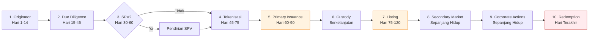
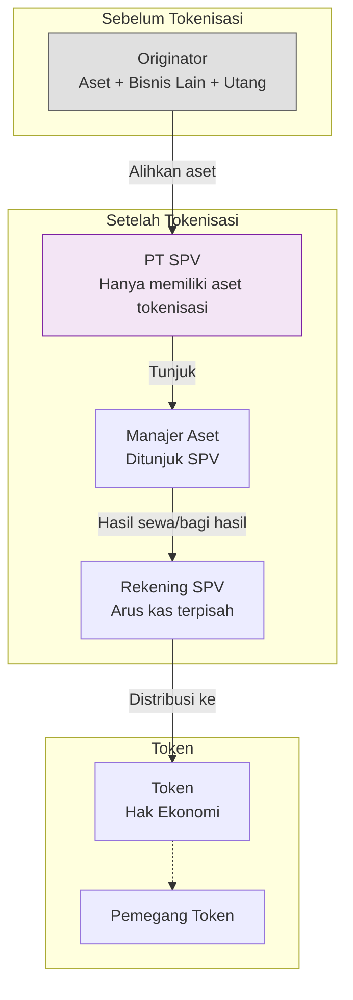
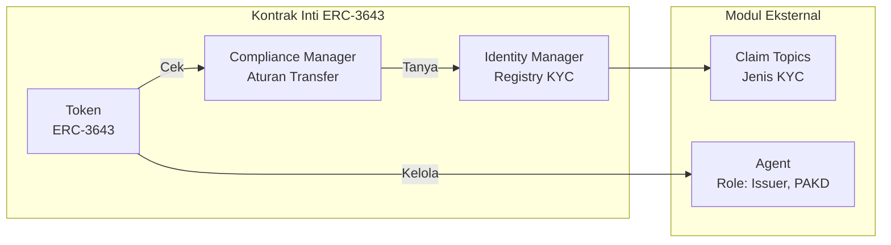
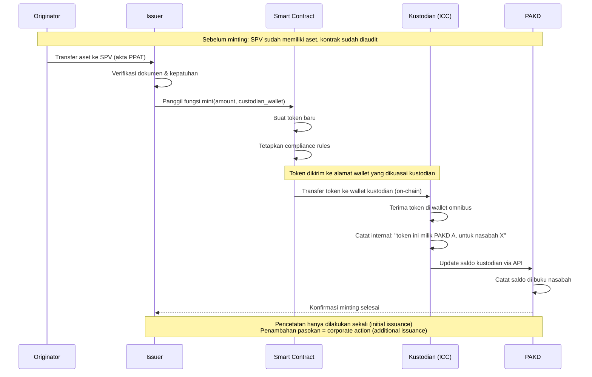
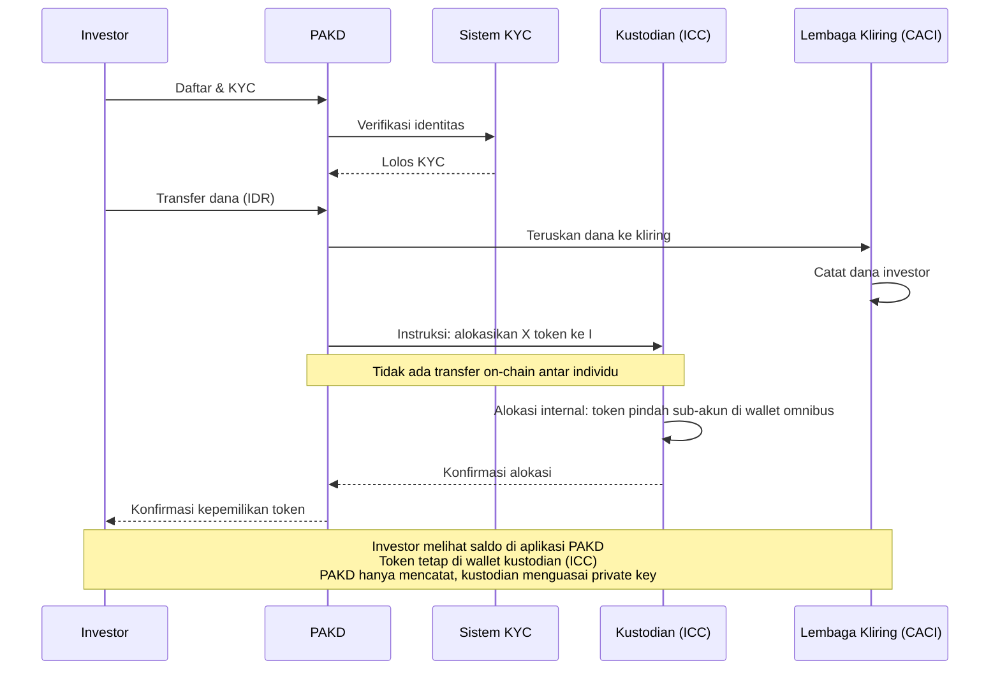
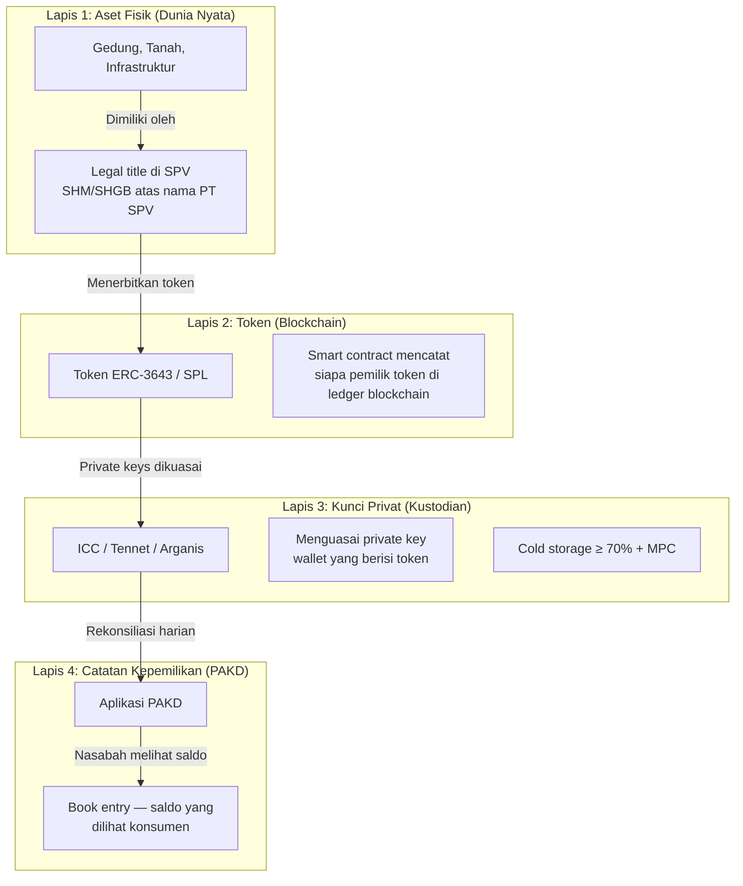
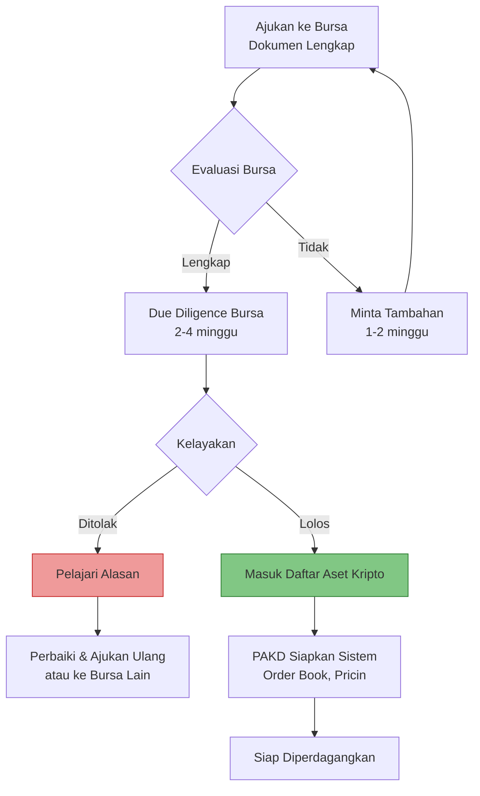
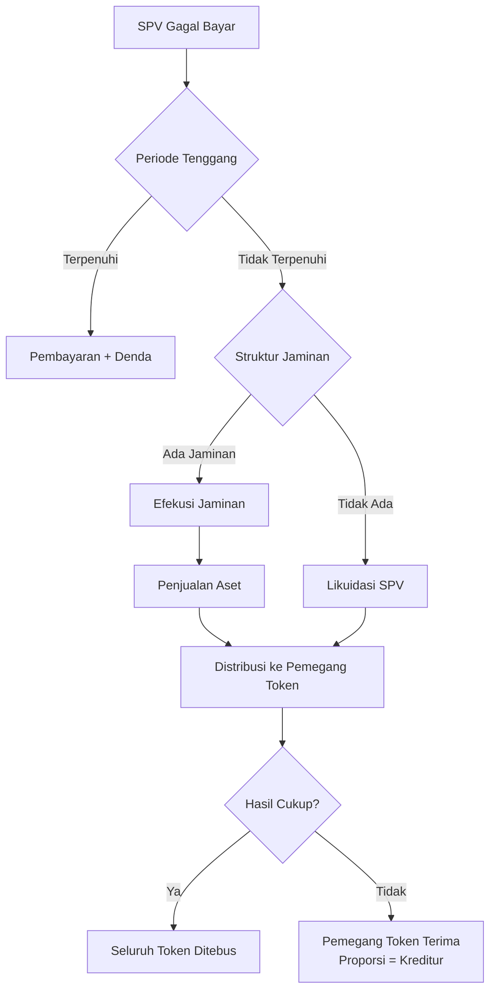
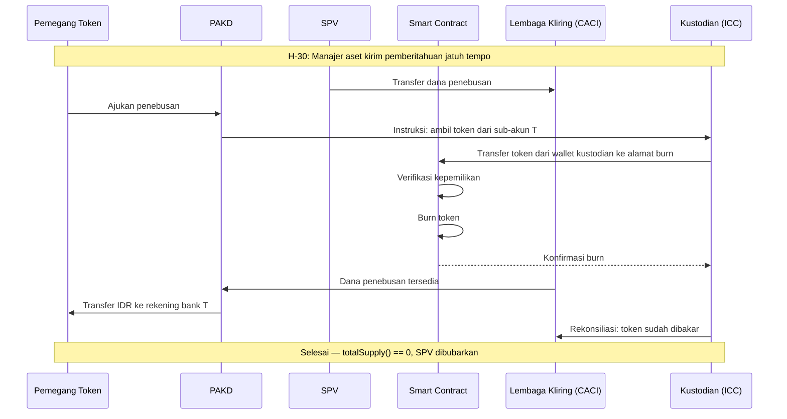
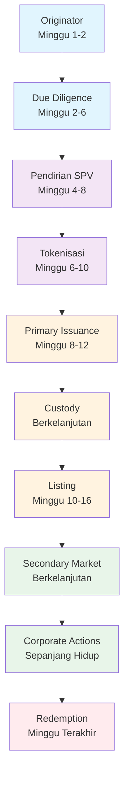

# Siklus Hidup Tokenisasi Aset Dunia Nyata (RWA)

Bab ini menjawab satu pertanyaan: **Jika saya ingin menokenisasi aset di Indonesia, apa yang harus terjadi — secara kronologis — dari hari pertama hingga hari token terakhir dimusnahkan?**

Setiap seksi adalah satu tahap yang harus Anda lalui. Urutannya bersifat wajib — Anda tidak dapat melompati tahap atau mengubah urutan tanpa konsekuensi hukum dan regulasi. Setiap tahap juga merupakan *gate*: jika tahap sebelumnya gagal, Anda berhenti di situ.

Bab ini mengasumsikan Anda telah memahami infrastruktur pasar yang dijelaskan dalam Bab 03 — peran PAKD, bursa (CFX dan ICEX), lembaga kliring, kustodian, dan kerangka pengawasan OJK. Bab ini tidak mengulang penjelasan tersebut kecuali untuk konteks.



**Dua titik kritis** yang ditandai di atas: Penerbitan Perdana (5) dan Pencatatan (7) adalah tahap paling berisiko karena melibatkan pihak eksternal (investor dan bursa) dan keputusan yang tidak sepenuhnya Anda kendalikan.

---

## 1. Originator — Titik Awal

**Pertanyaan:** Dari mana aset berasal? Siapa pemiliknya? Apakah mereka serius?

Titik awal siklus hidup tokenisasi bukanlah kode *Smart Contract*, juga bukan pengajuan izin ke OJK. Titik awalnya adalah **originator** — entitas yang memiliki aset dan ingin menjual hak ekonominya melalui token.

Jika Anda adalah perusahaan tokenisasi, originator adalah *customer* Anda. Tanpa originator, tidak ada aset. Tanpa aset, tidak ada token.

### Siapa Originator di Indonesia?

Originator dapat berupa:

| Jenis | Contoh Aset | Frekuensi di Indonesia |
|-------|------------|------------------------|
| **Perusahaan properti** | Gedung perkantoran, mal, hotel, kawasan industri | Paling umum |
| **Korporasi infrastruktur** | Jalan tol, jaringan telekomunikasi, pembangkit listrik | Potensi besar, aset bernilai triliunan |
| **Lembaga keuangan** | Portofolio piutang, KPR, pembiayaan | Kompleks secara regulasi |
| **Pemerintah daerah** | Pasar daerah, terminal, gedung serbaguna | Perlu izin Mendagri (PP 27/2014) |
| **BUMN/BUMD** | Aset negara yang dapat dikomersialkan | Butuh restrukturisasi |

### Apa yang Harus Anda Verifikasi dari Originator?

Sebelum menghabiskan waktu dan biaya, pastikan originator memenuhi tiga kondisi:

1. **Kepemilikan jelas.** Originator harus memiliki bukti kepemilikan yang sah dan tidak sedang dalam sengketa.
2. **Keseriusan finansial.** Originator harus bersedia membayar biaya persiapan — KJPP, legal, audit kontrak — yang dapat mencapai Rp500 juta–2 miliar untuk proyek pertama.
3. **Kesediaan melepaskan kontrol.** Originator harus bersedia mengalihkan aset ke SPV (lihat Seksi 3) dan kehilangan fleksibilitas untuk menjaminkan aset ke bank.

### Mengapa Originator Membutuhkan Anda?

Originator tidak datang ke tokenisasi karena teknologi. Mereka datang karena masalah bisnis:

| Masalah | Mengapa Tokenisasi Menarik |
|---------|---------------------------|
| Aset Rp500 miliar+ tidak bisa dijual sebagian | Fraksionalisasi — jual token, bukan bangunan |
| Bank sudah mencapai BMPK | Pendanaan baru tanpa utang bank |
| Sekuritisasi konvensional lambat dan mahal | Biaya lebih rendah, waktu lebih cepat |
| Ingin pendanaan dari investor institusional | Akses ke likuiditas pasar modal digital |
| Aset menganggur, perlu *monetize* | Menjual hak ekonomi sambil tetap mengelola |

**Yang tidak boleh Anda lakukan:** Jangan menjanjikan kecepatan yang tidak realistis. Proyek pertama minimum 6 bulan. Jangan menjanjikan bahwa tokenisasi pasti mendapat persetujuan bursa.

### Paradoks Biaya Persiapan RWA

Tiga langkah pertama di atas — uji tuntas hukum, valuasi KJPP, audit kontrak pintar — secara regulasi masuk akal. Namun jika dilihat dari kacamata bisnis dan janji utama blockchain, angka Rp500 juta hingga Rp2 miliar untuk biaya persiapan adalah paradoks yang bisa membunuh industri RWA di Indonesia sebelum berkembang.

**1. Ilusi "Demokratisasi" dan Pemotongan Perantara**

Narasi utama tokenisasi dan blockchain adalah memotong perantara untuk menekan biaya dan mendemokratisasi akses investasi. Namun kenyataannya, tokenisasi RWA justru menambahkan perantara baru — auditor kontrak pintar, platform tokenisasi, kustodian digital — di atas perantara tradisional yang sudah ada: KJPP, notaris, konsultan hukum, OJK.

Proses ini tidak lebih efisien dari penerbitan DIRE (Dana Investasi Real Estat) atau KIK-EBA tradisional. Alih-alih memotong biaya, originator justru menanggung beban ganda: sistem tradisional ditambah sistem Web3.

**2. Batas Minimum Skala Ekonomi**

Jika biaya persiapan mencapai Rp2 miliar, menokenisasi aset bernilai Rp10 miliar menjadi tidak rasional — biaya persiapan menyedot 20% dari nilai aset. Originator aset kelas menengah (UKM, properti menengah) akan mundur dan memilih meminjam ke bank yang biaya provisi dan administrasinya sekitar 1–2%.

Tokenisasi pada akhirnya hanya menjadi arena eksklusif bagi aset raksasa di atas Rp100 miliar — ironisnya berlawanan dengan semangat awal RWA yang justru ingin membuka akses ke aset-aset *niche* dan menengah.

**3. Risiko Likuiditas yang Belum Teruji**

Originator diminta membayar biaya persiapan besar di muka untuk mengakses pasar sekunder kripto di Indonesia (CFX/ICEX). Namun berbeda dengan Bursa Efek Indonesia yang likuiditasnya triliunan rupiah per hari, pasar sekunder untuk token sekuritas/RWA di Indonesia saat ini masih belum teruji likuiditasnya.

Jika originator menghabiskan Rp2 miliar untuk persiapan, tetapi token tidak laku saat penerbitan perdana atau tidak ada volume perdagangan di pasar sekunder, originator mengalami kerugian fatal.

**Implikasi untuk Strategi Anda:**

Jika industri RWA Indonesia ingin bertahan, ekosistem harus menemukan cara menekan biaya persiapan. Beberapa jalur yang dapat ditempuh:

- **Standardisasi draf hukum** — templating perjanjian SPV, perjanjian penerbitan, dan opini hukum sehingga tidak perlu *from scratch* setiap proyek.
- **Model penilaian otomatis (AVM)** untuk aset standar — properti residensial di kawasan tertentu dapat dinilai dengan algoritma, bukan KJPP full appraisal.
- **Subsidi atau keringanan biaya dari bursa/regulator** — *regulatory sandbox* OJK dapat menjadi laboratorium untuk menekan biaya kepatuhan.
- **Agregasi aset** — menggabungkan beberapa aset kecil dalam satu SPV sehingga biaya persiapan terbagi (lihat juga: *fractional ownership* dari portofolio, bukan aset tunggal).

Paradoks ini belum memiliki jawaban di Indonesia pada Juli 2026. Founder yang berhasil adalah yang menemukan model bisnis untuk memecahkannya — bukan yang mengabaikannya.

### Dokumen yang Wajib Anda Kumpulkan pada Tahap Ini

| Dokumen | Fungsi |
|---------|--------|
| Akta kepemilikan / sertifikat | Bukti originator adalah pemilik sah |
| Laporan keuangan 2 tahun terakhir | Menilai kesehatan keuangan originator |
| Profil manajemen | Siapa yang akan mengelola aset |
| Pernyataan minat tertulis | Komitmen awal originator |
| Struktur aset detail | Luas, lokasi, status, penyewa |

### Gate 1: Apakah Originator Lolos?

Anda hanya boleh melanjutkan ke Seksi 2 jika:

- [ ] Kepemilikan aset terverifikasi secara awal (setidaknya dari dokumen publik).
- [ ] Originator memiliki kapasitas finansial untuk membiayai proses persiapan.
- [ ] Originator memahami bahwa tokenisasi bukan pinjaman dan tidak dijamin oleh bank.
- [ ] Tidak ada *red flag* awal (sengketa, kepemilikan ganda, izin tidak lengkap).

**Jika tidak lolos:** Hentikan. Biaya yang dikeluarkan pada tahap ini minimal — hanya waktu konsultasi. Jangan lanjutkan ke uji tuntas jika originator belum siap.

---

## 2. Uji Tuntas Aset — Apakah Aset Ini Layak Ditokenisasi?

**Pertanyaan:** Apakah aset ini benar-benar milik originator? Berapa nilainya? Risiko apa yang melekat?

Tahap ini adalah gerbang paling penting. Jika uji tuntas menghasilkan temuan negatif, Anda harus berhenti — berapa pun biaya yang sudah dikeluarkan. Jangan pernah menulis kode *Smart Contract* sebelum uji tuntas selesai.

### 2.1 Pemeriksaan Kepemilikan Hukum

**Anda harus menyewa kantor hukum** yang terdaftar di OJK atau berpengalaman di pasar modal Indonesia. Biaya legal opinion untuk aset properti komersial tipikal Rp100–300 juta tergantung kompleksitas.

Tim hukum memeriksa:

| Item | Detail | Red Flag |
|------|--------|----------|
| **Sertifikat kepemilikan** | SHM, SHGB, atau HPL? Sesuai dengan aset? | SHGB akan jatuh tempo — pengaruhi valuasi |
| **Rantai kepemilikan** | Riwayat peralihan 20 tahun | Ada lompatan atau akta bermasalah |
| **Beban dan jaminan** | Hak tanggungan, fidusia, *cross-collateral*? | Aset sedang dijaminkan ke bank — butuh *release* |
| **Izin** | PBG, SLF, AMDAL | Izin tidak ada atau kedaluwarsa |
| **Sengketa** | Gugatan di pengadilan? | Sengketa aktif = tidak layak |
| **Perjanjian sewa** | Jangka waktu, *first refusal*, harga | Sewa di bawah pasar atau penyewa dominan |

**Dokumen keluaran:** *Legal opinion* yang menyatakan aset bebas sengketa dan siap dialihkan ke SPV.

**Siapa yang melakukan:** Kantor hukum yang ditunjuk penerbit.
**Siapa yang mengawasi:** OJK (dapat meminta saat pemeriksaan), bursa (saat pengajuan listing).

**Jika gagal:** Cacat kepemilikan = proses berhenti. Originator harus menyelesaikan masalah hukum terlebih dahulu — biaya di luar Anda.

### 2.2 Valuasi — Menentukan Berapa Nilai Aset

**Anda harus menyewa KJPP** (Kantor Jasa Penilai Publik) yang terdaftar di OJK — KJPP yang sama yang digunakan reksa dana dan EBA di pasar modal Indonesia. Biaya valuasi properti komersial tipikal Rp50–150 juta.

KJPP menggunakan tiga metode:

| Metode | Cocok Untuk | Cara Kerja |
|--------|------------|------------|
| **Pendapatan (DCF)** | Gedung sewa, infrastruktur, aset dengan arus kas stabil | Diskon arus kas masa depan |
| **Perbandingan pasar** | Properti dengan data transaksi sejenis | Bandingkan dengan aset serupa yang baru terjual |
| **Biaya** | Aset khusus (pabrik, pembangkit) | Biaya penggantian - depresiasi |

**Yang harus Anda perhatikan:** Laporan KJPP memiliki masa berlaku — biasanya 6–12 bulan. Jika proses tokenisasi molor melewati masa berlaku, Anda harus minta KJPP melakukan pembaruan (*update*). Ini biaya tambahan.

Juga perhatikan: KJPP menilai **nilai wajar aset** (*fair value*), bukan nilai token. Nilai token ditentukan oleh struktur penerbitan — bisa sama, di atas, atau di bawah nilai wajar tergantung *haircut* yang Anda terapkan.

### 2.3 Penilaian Risiko

Tim manajemen risiko Anda (atau konsultan) harus menyusun matriks risiko:

| Jenis Risiko | Kemungkinan | Dampak | Mitigasi |
|---|---|---|---|
| Penyewa gagal bayar | Sedang | Tinggi | Diversifikasi penyewa, *reserve fund* 3 bulan |
| Nilai aset turun | Rendah | Tinggi | *Loan-to-Value* maksimal 70% |
| Token tidak likuid | Tinggi | Sedang | *Market making* tersedia, *buyback* terjadwal |
| Bencana alam | Rendah | Sangat Tinggi | Asuransi properti + *business interruption* |
| Cacat hukum | Rendah | Sangat Tinggi | *Legal opinion* + *warranty* dari originator |

### 2.4 Dokumen Lengkap — Ceklis Uji Tuntas

Pada akhir tahap ini, Anda harus memiliki SEMUA dokumen berikut. Jika satu saja hilang, jangan lanjutkan:

- [ ] Sertifikat kepemilikan (SHM/SHGB/HPL) — fotokopi + pengecekan BPN
- [ ] Laporan penilaian KJPP — berlaku 6–12 bulan
- [ ] *Legal opinion* — menyatakan aset bebas sengketa
- [ ] Laporan uji tuntas pajak — PBB, PPh final, BPHTB
- [ ] Laporan AMDAL/UKL-UPL — untuk aset yang memerlukan
- [ ] Perjanjian sewa (jika ada) — seluruhnya, termasuk *addendum*
- [ ] Polis asuransi — properti + *business interruption*
- [ ] *Financial model* — proyeksi arus kas 5 tahun dengan skenario *stress*
- [ ] Matriks risiko — ditandatangani manajemen risiko

### Gate 2: Apakah Aset Lolos Uji Tuntas?

Anda hanya boleh melanjutkan ke Seksi 3 jika:

- [ ] *Legal opinion* menyatakan tidak ada cacat kepemilikan.
- [ ] Nilai aset menurut KJPP ≥ target penerbitan awal.
- [ ] Seluruh izin (PBG/SLF/AMDAL) valid dan tidak kedaluwarsa.
- [ ] Tidak ada sengketa aktif.
- [ ] Asuransi properti *in force*.

**Jika tidak lolos:** Berhenti. Beri tahu originator alasannya secara tertulis. Simpan seluruh dokumen uji tuntas — originator mungkin kembali setelah masalah diselesaikan. Jangan pernah melanjutkan tokenisasi di atas fondasi hukum yang rapuh.

---

## 3. *Special Purpose Vehicle* — Memisahkan Aset dari Originator

**Pertanyaan:** Apakah aset perlu dipisahkan secara hukum dari originator? Jika ya, bagaimana caranya?

### Mengapa Anda Mungkin Membutuhkan SPV

SPV — biasanya berbentuk **PT (Perseroan Terbatas)** — didirikan khusus untuk memiliki aset yang ditokenisasi. Tujuannya:

1. **Melindungi aset dari kreditor originator.** Jika originator bangkrut esok hari, kreditor originator TIDAK bisa menyita aset yang sudah dialihkan ke SPV. Ini adalah *bankruptcy remoteness*.
2. **Memisahkan arus kas.** Pendapatan aset masuk ke rekening SPV, bukan rekening originator. Tidak ada percampuran dana.
3. **Memberikan kepastian hukum ke pemegang token.** Pemegang token tahu bahwa aset yang menjadi jaminan token mereka berada di entitas yang terisolasi.



### Kapan Anda TIDAK Perlu SPV?

| Situasi | Penjelasan | Risiko Tanpa SPV |
|---------|-----------|------------------|
| Aset sudah berupa efek (saham, obligasi) | Token cukup mewakili efek — KSEI sudah memisahkan | Rendah, jika efek tercatat |
| Struktur KIK | Kontrak Investasi Kolektif — bukan badan hukum, tapi diawasi OJK | Sedang — bergantung pada Manajer Investasi |
| Token sebagai utang langsung originator | Originator terbitkan obligasi digital | Tinggi — kreditor originator setara dengan pemegang token |
| Aset berkapitalisasi kecil (< Rp50 miliar) | Biaya pendirian SPV tidak proporsional | Sedang — perlu jaminan pribadi originator |

> **Keputusan akhir:** Konsultasikan dengan konsultan hukum dan pajak. SPV memiliki implikasi perpajakan (PPh Badan 22%, PPh final dividen 20%) dan biaya tahunan (audit, laporan, notaris). Terkadang biaya ini lebih besar dari manfaat perlindungan aset.

### Implikasi SPV di Indonesia — Yang Harus Anda Urus

1. **PPAT.** Pengalihan aset (tanah/bangunan) harus di hadapan PPAT. Biaya BPHTB ~5% dari nilai pengalihan.
2. **Pembatasan kegiatan.** Anggaran dasar SPV harus secara eksplisit membatasi kegiatan — hanya memiliki dan mengelola aset ini. Jika tidak, *bankruptcy remoteness* bisa gugur.
3. **Manajer aset.** SPV dapat menunjuk originator sebagai manajer aset melalui perjanjian pengelolaan. Imbalan manajer kena PPh dan PPN.
4. **Perjanjian wali amanat.** Jika struktur token memerlukan wali amanat (*trustee*) untuk melindungi kepentingan pemegang token.
5. **Kustodian fisik.** Sertifikat asli aset harus disimpan di tempat yang aman — bank atau kustodian berizin.

### Dokumen yang Harus Ada

- [ ] Akta Pendirian SPV — dengan kegiatan terbatas
- [ ] Akta Pengalihan Aset — dari originator ke SPV
- [ ] Perjanjian Pengelolaan Aset — menunjuk manajer
- [ ] Perjanjian Wali Amanat — jika diperlukan
- [ ] Perjanjian Kustodian Fisik — penyimpanan sertifikat
- [ ] Opini Hukum *Bankruptcy Remoteness* — dokumen TERPENTING

### Gate 3: Apakah SPV Siap?

Anda hanya boleh melanjutkan ke Seksi 4 jika:

- [ ] SPV sudah terdaftar sebagai PT dan memiliki NPWP.
- [ ] Aset sudah dialihkan ke SPV (akta PPAT sudah ditandatangani).
- [ ] Opini hukum *bankruptcy remoteness* sudah diterbitkan.
- [ ] Perjanjian pengelolaan aset sudah ditandatangani.
- [ ] Rekening SPV sudah aktif dan terpisah.

**Jika tidak lolos:** Jangan minting token. Token yang diterbitkan sebelum SPV siap adalah token tanpa jaminan hukum. Pemegang token tidak punya perlindungan apa pun jika originator bangkrut.

---

## 4. Tokenisasi — Menulis Kode yang Mewakili Aset

**Pertanyaan:** Di *blockchain* mana token akan hidup? Standar apa yang digunakan? Bagaimana cara mencetaknya?

Pada tahap ini, Anda benar-benar menulis kode. Ini adalah satu-satunya tahap di mana teknologi *blockchain* menjadi pusat perhatian — tetapi jangan lupa: kode ini hanya berguna jika tahap 1–3 selesai dengan benar.

### Pemilihan *Blockchain*

Pilihan *blockchain* adalah keputusan arsitektur yang paling berdampak jangka panjang. Di Indonesia, pilihan ini dibatasi oleh kompatibilitas dengan infrastruktur SRO yang ada.

| Faktor | Ethereum (ERC) | Solana (SPL) | Polygon | Private Chain |
|--------|---------------|-------------|---------|---------------|
| Dukungan kustodian ICC | Terkonfirmasi | Dalam pengembangan | Perlu konfirmasi | Tidak didukung |
| Biaya transaksi | Tinggi (gas) | Rendah | Rendah | Minimal |
| Kecepatan finalitas | ~12 detik | ~400 ms | ~2 detik | Bergantung konsensus |
| Maturitas RWA | ERC-3643 mapan | Masih awal | Beberapa proyek | Tidak ada standar |
| Interoperabilitas bursa | CFX & ICEX | ICEX | Perlu verifikasi | Tidak |
| Likuiditas pengembang | Tinggi | Sedang | Sedang | Rendah |

Rekomendasi untuk pendiri yang baru memulai: **Ethereum (ERC-3643)** adalah pilihan paling aman pada 2026 karena dukungan kustodian, standar token yang mapan untuk RWA, dan ketersediaan pengembang. Jika target utama adalah ICEX dengan biaya transaksi rendah, Solana (SPL) adalah alternatif yang perlu dipertimbangkan — tetapi pastikan kustodian ICC mendukungnya.

### Standar Token

Untuk RWA, standar token *permissioned* (terbatas) lebih relevan daripada standar token terbuka:

| Standar | Deskripsi | Keunggulan |
|---------|-----------|------------|
| **ERC-3643** (T-REX) | Token dengan modul kepatuhan terintegrasi — hanya dapat ditransfer jika penerima memenuhi aturan | *De facto* standar RWA global. Dukungan modul KYC, *batch issuance*, *freeze*, *recovery* |
| ERC-1404 | Token dengan fungsi *transfer* yang dapat diperiksa oleh *controller* | Lebih sederhana dari ERC-3643, cocok untuk MVP |
| ERC-20 + *wrapper* | ERC-20 standar dengan kontrak kepatuhan terpisah | Fleksibel, tetapi membutuhkan arsitektur yang lebih kompleks |
| SPL Token + *compliance module* | Token Solana dengan modul kepatuhan terpisah | Biaya rendah, cepat |

ERC-3643 (T-REX) menggunakan arsitektur modular:



### Metadata

Metadata adalah data yang menjelaskan hubungan antara token dengan aset dunia nyata. Metadata disimpan secara *off-chain* (di IPFS, AWS S3, atau server penerbit) dengan *hash* digital yang dicatat di rantai.

```json
{
  "name": "Gedung Sentral Plaza Token 2026-001",
  "description": "Token yang mewakili hak ekonomi atas Gedung Sentral Plaza, Jakarta Selatan",
  "assetType": "commercial-property",
  "assetLocation": "Jakarta Selatan, DKI Jakarta",
  "legalOwner": "PT Sentral Plaza SPV",
  "legalOwnerAddress": "0x...",
  "totalSupply": 1000000000,
  "tokenUnitValue": 1000,
  "currency": "IDR",
  "assetValuation": 100000000000000,
  "valuationDate": "2026-01-15",
  "kjppReport": "ipfs://Qm...",
  "legalOpinion": "ipfs://Qm...",
  "couponRate": 8.5,
  "couponFrequency": "quarterly",
  "maturityDate": "2031-06-30",
  "originator": "PT Sentral Plaza Utama",
  "assetManager": "PT Sentral Plaza Utama",
  "custodian_physical": "PT Bank ABC",
  "taxWithholding": "20%",
  "jurisdiction": "Indonesia"
}
```

### Metadata Kepatuhan

Metadata kepatuhan berisi informasi yang diperlukan oleh PAKD dan regulator untuk melaksanakan APU PPT:

```json
{
  "compliance": {
    "restrictedJurisdictions": ["US", "IR", "KP"],
    "kycRequired": true,
    "whitelistOnly": true,
    "transferDelay": 0,
    "maxHoldingPerWallet": 50000000000,
    "minHoldingPeriod": 0,
    "regulatoryRegime": "OJK-IAKD",
    "regulatoryClassification": "AKD-RWA",
    "exchangeListingId": "CFX-SP-2026-001",
    "pakhRegistered": "PT DigiAset Indonesia"
  }
}
```

### Arsitektur *Smart Contract*

Arsitektur *Smart Contract* untuk RWA berbeda secara fundamental dari arsitektur DeFi. Kontrak RWA harus mendukung intervensi hukum dan kepatuhan:

| Komponen | Fungsi | Dicatat di Rantai? |
|----------|--------|-------------------|
| Token contract | ERC-3643 / SPL | Ya |
| Identity Registry | Menyimpan *hash* dokumen KYC | Ya |
| Compliance Module | Aturan transfer, *freeze*, *unfreeze* | Ya |
| Payment Disbursement | Distribusi kupon/bagi hasil | Hybrid (on-chain + bank transfer) |
| Oracle Interface | Menerima data NAV, harga aset | Ya |
| Corporate Action Executor | Eksekusi aksi korporasi | Ya |
| Pause Guardian | Kemampuan memberhentikan transfer | Ya |

**Pause Guardian** adalah komponen yang penting di Indonesia. OJK dapat memerintahkan penghentian perdagangan atau pembekuan aset. *Smart Contract* harus menyediakan mekanisme bagi PAKD atau penerbit untuk mematuhi perintah tersebut. Fungsi *pause* harus diatur dalam *multisig* — tidak dapat dieksekusi oleh satu pihak.

### Proses Pencetakan (*Minting*)



**Siapa yang melakukan:** Penerbit (*issuer*) yang memiliki akses ke fungsi *minting* *Smart Contract*.
**Siapa yang mengawasi:** Auditor *Smart Contract* (pihak ketiga independen), OJK melalui laporan.
**Dokumen:**
- Laporan audit *Smart Contract*
- *Hash* kode kontrak yang tercatat di blockchain explorer
- Dokumentasi arsitektur teknis
**Resiko:** Cacat kode *Smart Contract* dapat menyebabkan token tidak dapat ditransfer, dibekukan, atau dicetak ulang. **Risiko paling serius:** *backdoor* dalam kontrak yang memungkinkan pihak tidak berwenang mencetak token baru.

**Jika gagal:** Jika *Smart Contract* memiliki kerentanan yang terdeteksi dalam audit, minting tidak boleh dilakukan sampai kontrak diperbaiki dan diaudit ulang. Jika minting sudah dilakukan dan kerentanan ditemukan setelahnya — skenario terburuk — kontrak mungkin perlu *upgrade* atau *migrate* ke kontrak baru dengan persetujuan pemegang token.

### Gate 4: Apakah Token Siap Dicetak?

Anda hanya boleh mencetak token jika:

- [ ] *Smart Contract* sudah diaudit oleh auditor pihak ketiga independen.
- [ ] Tidak ada temuan kritis atau high dalam laporan audit.
- [ ] *Hash* kode kontrak sudah dicatat.
- [ ] Metadata token (termasuk dokumen uji tuntas) sudah final.
- [ ] Modul kepatuhan (Identity Registry, Compliance) sudah terisi.
- [ ] PAKD mitra sudah mengonfirmasi kompatibilitas.

**Jika tidak lolos:** Jangan cetak. Token yang dicetak dengan kontrak bermasalah adalah liabilitas hukum. Jika audit menemukan *critical issue*, perbaiki kode dan audit ulang. Biaya audit ulang adalah biaya Anda — jangan terburu-buru.

---

## 5. Penerbitan Perdana — Token Berpindah ke Investor

**Pertanyaan:** Siapa investor pertama? Bagaimana mereka membeli? Bagaimana dana diselesaikan?

Ini adalah saat di mana token benar-benar meninggalkan *Smart Contract* dan masuk ke dompet investor. Jika tahap 1–4 adalah persiapan, tahap 5 adalah **transaksi pertama yang nyata**.

### Investor Awal

Penerbitan perdana tidak terbuka untuk publik seperti IPO. Sebaliknya, token ditawarkan melalui dua jalur:

1. **Penawaran terbatas (*limited offering*)** — kepada investor yang sudah memiliki hubungan dengan PAKD atau penerbit. Jumlah investor terbatas (maksimal 300 investor dalam 12 bulan — jika melampaui, instrumen dapat diklasifikasikan sebagai penawaran umum yang memerlukan izin OJK pasar modal).
2. **Penawaran melalui PAKD** — PAKD yang menjadi mitra menawarkan token kepada nasabahnya yang telah lolos KYC.

Jenis investor yang umum dalam penerbitan perdana RWA di Indonesia:
- **Investor institusional** (dana pensiun, perusahaan asuransi, manajer investasi)
- **Nasabah PAKD terverifikasi** (individu dengan profil risiko sesuai)
- **Investor akreditasi** (minimum aset tertentu — ketentuan masih menunggu POJK lanjutan OJK IAKD)

### Proses Langganan (*Subscription*)



### KYC/AML

Setiap investor harus melalui proses KYC yang memenuhi standar OJK (POJK 27/2024 dan SEOJK 16/2025):

| Persyaratan | Dokumen |
|-------------|---------|
| Identitas diri | KTP (WNI) / Paspor (WNA) + KITAS |
| NPWP | Wajib pajak Indonesia |
| Profil risiko | Kuesioner profil risiko |
| Sumber dana | Slip gaji, SPT, laporan keuangan |
| Tujuan investasi | Pernyataan tertulis |
| *Beneficial owner* | Jika atas nama entitas |

PAKD wajib menyimpan dokumen KYC selama 5 tahun setelah hubungan bisnis berakhir (POJK 12/2017 jo. SEOJK 16/2025).

### Alokasi

Proses alokasi dapat dilakukan dengan metode:

- ***Pro rata*** — setiap investor mendapat token sesuai proporsi dana yang disetorkan dibanding total permintaan.
- ***Priority allocation*** — investor institusional mendapat prioritas.
- ***Tranche*** — alokasi dibagi dalam beberapa tahap berdasarkan jenis investor.

Setelah alokasi ditentukan, PAKD memberikan instruksi ke kustodian untuk mengalokasikan token dari *pool* penerbit ke sub-akun investor — token tidak berpindah antar-wallet on-chain, melainkan dialokasikan secara internal di sistem kustodian.

### Penyelesaian (*Settlement*)

Penyelesaian penerbitan perdana di Indonesia dilakukan melalui mekanisme berikut:

1. Dana investor diteruskan oleh PAKD ke lembaga kliring (KKI untuk CFX, CACI untuk ICEX).
2. PAKD mengirim instruksi ke kustodian untuk mengalokasikan token ke sub-akun investor.
3. Kustodian mencatat alokasi internal — token tetap di wallet omnibus kustodian, tetapi secara administratif menjadi milik investor.
4. Lembaga kliring mengonfirmasi dana sudah diterima.
5. PAKD mengirimkan konfirmasi kepada investor.

> **Penting:** Dalam model kustodian Indonesia, token tidak ditransfer on-chain antar individu. Token tetap di wallet yang dikuasai kustodian. Yang berpindah hanyalah alokasi internal di sistem kustodian. Ini berbeda dengan model DeFi di mana token berpindah antar-wallet pribadi.

**Siapa yang melakukan:** PAKD (sebagai perantara), penerbit, lembaga kliring, kustodian.
**Siapa yang mengawasi:** OJK (melalui laporan), bursa, auditor.
**Dokumen:**
- Perjanjian pembelian token
- Bukti transfer dana ke rekening kliring
- Konfirmasi alokasi kustodian
- Laporan KYC
- Surat konfirmasi kepemilikan
**Resiko:** *Under-subscription* (token tidak habis terjual), *over-subscription* (permintaan melebihi pasokan), dana tidak sampai ke kliring.

### Gate 5: Apakah Penerbitan Perdana Berhasil?

Penerbitan perdana dinyatakan berhasil jika:

- [ ] Jumlah token terjual mencapai minimum *subscription* (sesuai perjanjian).
- [ ] Seluruh dana investor sudah diteruskan ke lembaga kliring.
- [ ] Seluruh token sudah ditransfer ke dompet investor.
- [ ] Kustodian sudah mengonfirmasi saldo token.
- [ ] Dokumen KYC seluruh investor lengkap.

**Jika gagal (under-subscription):** Dana dikembalikan ke investor. Biaya persiapan (audit kontrak, KJPP, legal) menjadi beban Anda. Jangan gunakan dana investor untuk keperluan lain sebelum *minimum subscription* tercapai — ini dapat dikenakan pidana UU P2SK.

---

## 6. Kustodi — Di Mana Aset dan Token Disimpan?

**Pertanyaan:** Di mana aset fisik disimpan? Di mana token digital disimpan? Siapa yang bertanggung jawab jika terjadi kehilangan?

Kustodi dalam tokenisasi RWA melibatkan DUA jenis aset yang sangat berbeda: **aset fisik** (gedung, tanah, sertifikat) dan **token digital** (dicatat di blockchain). Keduanya memerlukan pengaturan kustodi yang terpisah.

### Memahami Empat Lapis Kepemilikan

Sebelum membahas kustodi, Anda harus memahami bahwa tokenisasi RWA menciptakan **empat lapis kepemilikan** yang terpisah secara hukum dan teknis:



**Apa artinya bagi investor dan regulator:**

| Lapis | Apa | Siapa yang Menguasai | Dicatat di Mana |
|-------|-----|----------------------|-----------------|
| 1 — Aset fisik | Gedung, tanah | SPV (legal title) | BPN, akta PPAT |
| 2 — Token | Hak ekonomi terprogram | Blockchain (smart contract) | Blockchain (ledger) |
| 3 — Kunci privat | Akses kontrol token | Kustodian (ICC dkk) | Sistem kustodian + HSM |
| 4 — Catatan nasabah | Saldo yang dilihat investor | PAKD (book entry) | Database PAKD |

Kustodian (Lapis 3) **memegang private key** yang mengontrol token di blockchain. Mereka tidak sekadar mencatat — mereka benar-benar menguasai wallet. Ketika Anda melakukan minting, token dikirim ke alamat wallet yang kunci privatnya dipegang kustodian. Investor tidak pernah memegang private key — mereka hanya memiliki catatan kepemilikan di sistem PAKD (Lapis 4).

### Kustodi Aset Fisik (Lapis 1)

Aset fisik tidak bisa disimpan di kustodian kripto. Aset fisik tetap dikelola oleh:

- **SPV** sebagai pemilik legal (Lapis 1).
- **Manajer aset** sebagai pengelola operasional.
- **Bank** — rekening SPV yang menampung pendapatan dari aset.

Kustodian fisik memastikan sertifikat asli (SHM/SHGB) disimpan di *safe deposit box* bank, rekening SPV diawasi, dan tidak ada pengalihan aset tanpa persetujuan wali amanat.

### Kustodi Token Digital (Lapis 2 + 3)

Token digital — yang merupakan satu-satunya aset digital dalam struktur ini — **wajib disimpan di kustodian aset keuangan digital berizin OJK**: ICC, Tennet, atau Arganis.

Yang dimaksud "kustodian menyimpan token" berarti:

- Kustodian menguasai **private key** dari wallet yang berisi token (Lapis 3).
- Minimal 70% token nasabah disimpan di *cold storage* — private key tidak terhubung ke internet.
- Token secara teknis berada di alamat blockchain yang dikuasai kustodian.
- Saat nasabah "memiliki" token, mereka tidak memegang private key — mereka memiliki catatan kepemilikan di PAKD (Lapis 4), dan kustodian mencatat alokasi token tersebut di sistem internalnya.

**Contoh dengan ICEX:**

ICEX bekerja sama dengan ICC sebagai kustodian. Jika Anda menerbitkan token RWA melalui ICEX:

1. Token dicetak dan dikirim ke alamat wallet omnibus ICC.
2. ICC mencatat di sistem internalnya: "100.000 token milik PAKD A untuk nasabah X".
3. PAKD A menampilkan saldo 100.000 token ke nasabah X di aplikasi.
4. Saat nasabah X menjual 10.000 token ke nasabah Y, ICC memindahkan alokasi internal — token bisa tetap di wallet omnibus yang sama, atau dipindahkan antar sub-wallet.
5. Setiap akhir hari, ICC, ICEX, dan lembaga kliring (CACI) melakukan rekonsiliasi untuk mencocokkan catatan.

**Implikasi teknis untuk *Smart Contract* Anda:**

*Smart Contract* token harus kompatibel dengan sistem kustodian. ICC menggunakan teknologi MPC (*Multi-Party Computation*) dan *multi-signature wallet*. Token Anda harus mendukung:
- *Freeze* — jika OJK memerintahkan penghentian perdagangan.
- *Recovery* — jika terjadi kehilangan akses wallet.
- *Multi-signature* — transaksi besar memerlukan persetujuan multipihak.

### 6.3 Hubungan Hukum — Apa yang Sebenarnya Dimiliki Pemegang Token?

Ini adalah pertanyaan paling fundamental. Jawabannya tergantung struktur:

| Model | Hak Pemegang Token | Implikasi |
|-------|-------------------|-----------|
| **Token utang** | Hak tagih atas imbal hasil + pokok | Pemegang token = kreditor SPV |
| **Token ekuitas** | Hak atas laba bersih SPV | Pemegang token = pemegang saham |
| **Token *revenue share*** | Hak persentase pendapatan kotor | Bukan utang, bukan ekuitas |

**Yang harus Anda nyatakan secara eksplisit dalam perjanjian penerbitan:**

- Token BUKAN saham, BUKAN obligasi, dan BUKAN efek dalam pengertian UU Pasar Modal — kecuali jika memang terdaftar.
- Token hanya mewakili hak ekonomi yang diatur dalam perjanjian induk.
- Pemegang token TIDAK memiliki hak legal atas aset fisik — SPV-lah pemiliknya.
- Jika SPV dilikuidasi, prioritas pembayaran = sesuai struktur (junior/senior).

### Dokumen Kustodi

- [ ] Perjanjian Kustodian Aset Fisik — penyimpanan sertifikat
- [ ] Perjanjian Kustodian Token — penyimpanan token di kustodian OJK
- [ ] Prosedur Transfer — SOP perpindahan token antar-dompet
- [ ] Prosedur *Recovery* — jika kunci privat hilang
- [ ] Prosedur *Freeze* — jika ada perintah OJK

### Gate 6: Apakah Kustodi Berfungsi?

Anda boleh melanjutkan ke listing hanya jika:

- [ ] Perjanjian kustodian token sudah ditandatangani dengan kustodian berizin OJK.
- [ ] Perjanjian kustodian aset fisik (sertifikat) sudah aktif.
- [ ] Rekonsiliasi harian antara Anda dan kustodian sudah berjalan 3 hari tanpa selisih.
- [ ] Prosedur *freeze* dan *recovery* sudah diuji.

**Jika tidak lolos:** Jangan listing. Tanpa kustodian yang berfungsi, token tidak memenuhi persyaratan OJK. Token yang diperdagangkan tanpa kustodian berizin melanggar POJK 27/2024.

---

## 7. Pencatatan (*Listing*) — Token Masuk ke Bursa

**Pertanyaan:** Bagaimana cara token saya bisa diperdagangkan di bursa? Dokumen apa yang diperlukan? Berapa lama?

Tanpa pencatatan di bursa, token Anda hanya bisa diperdagangkan secara terbatas (*over-the-counter*). Pencatatan adalah **syarat mutlak** untuk mencapai likuiditas yang berarti.

### Apa yang Harus Anda Siapkan untuk Bursa

Persyaratan pencatatan ditetapkan oleh masing-masing bursa (CFX dan ICEX). Berdasarkan praktik yang berlaku, dokumen berikut hampir pasti diperlukan:

| Dokumen | Fungsi | Siapa yang Menerbitkan |
|---------|--------|----------------------|
| *Whitepaper* token | Struktur, ekonomi token, profil risiko | Anda (penerbit) |
| *Legal opinion* | Status hukum token dan SPV | Kantor hukum |
| Laporan audit *Smart Contract* | Tidak ada kerentanan kritis | Auditor pihak ketiga |
| Laporan KJPP | Nilai aset terkini | KJPP |
| Perjanjian SPV + opini *bankruptcy remoteness* | Bukti pemisahan aset | Kantor hukum |
| Perjanjian kustodian | Token tersimpan di kustodian berizin | Kustodian |
| Prosedur KYC | Yang digunakan PAKD mitra | PAKD |
| Proyeksi keuangan + *stress test* | Aset mampu membayar imbal hasil | Tim keuangan |
| Biodata manajemen | Pengalaman pengelola aset | Manajer aset |

### Proses Pencatatan — Langkah demi Langkah



**Waktu:** Proses evaluasi bursa tipikal 2–4 minggu untuk dokumen lengkap. Bisa lebih lama jika ada pertanyaan lanjutan.

### Pilihan Bursa — CFX vs ICEX

| Faktor | CFX | ICEX |
|--------|-----|------|
| Pengalaman listing RWA | Belum ada (tetapi terbuka) | Target utama |
| Jumlah anggota PAKD | ~25 PAKD | ~11 PAKD pemegang saham |
| Hubungan kustodian | ICC | ICC + CACI |
| Ekosistem | Mapan, lebih banyak likuiditas | Baru, lebih fleksibel |
| Fokus produk | Semua aset kripto | RWA + stablecoin |

**Strategi:** Ajukan ke dua bursa. Jika satu menolak, Anda masih punya kesempatan di bursa lain. Jika keduanya menyetujui, token Anda tercatat di dua bursa — semakin luas akses likuiditas.

### Hubungan dengan Bab 03

Proses pencatatan melewati bursa, bukan OJK. OJK menerima laporan dari bursa. Lihat Bab 03 untuk detail peran masing-masing SRO.

### Gate 7: Apakah Token Siap Listing?

Anda boleh listing hanya jika:

- [ ] Seluruh dokumen persyaratan bursa sudah lengkap dan disahkan.
- [ ] Bursa telah menyetujui dan memasukkan token ke Daftar Aset Kripto.
- [ ] PAKD mitra telah mengintegrasikan token ke sistem *order book*.
- [ ] Harga acuan (NAV) sudah ditetapkan dan dapat dihitung secara periodik.
- [ ] *Market maker* (lihat Seksi 8) sudah siap.
- [ ] Kustodian mengonfirmasi token dapat dipindahkan antar-nasabah.

**Jika gagal:** Token yang tidak tercatat di bursa hanya bisa diperdagangkan *over-the-counter* — likuiditas sangat terbatas. Pelajari alasan penolakan bursa. Jika masalahnya pada dokumen, perbaiki dan ajukan ulang. Jika masalahnya pada fundamental aset, pertimbangkan untuk menghentikan proyek.

---

## 8. Pasar Sekunder — Token Diperdagangkan

**Pertanyaan:** Setelah listing, bagaimana token benar-benar diperdagangkan? Siapa yang membeli? Bagaimana harga terbentuk?

Pasar sekunder adalah alasan utama mengapa investor membeli token RWA — mereka ingin likuiditas. Tanpa pasar sekunder yang berfungsi, token RWA tidak lebih berharga dari piutang biasa.

### Bagaimana Perdagangan Terjadi

Perdagangan token RWA di bursa Indonesia mengikuti mekanisme standar (lihat Bab 03):

1. Nasabah memasang order beli/jual melalui aplikasi PAKD.
2. PAKD meneruskan order ke sistem bursa (ICEX atau CFX).
3. Bursa mencocokkan order antar-PAKD.
4. Lembaga kliring (CACI untuk ICEX, KKI untuk CFX) menjamin penyelesaian.
5. PAKD mengirim instruksi ke kustodian: alihkan alokasi token dari sub-akun penjual ke sub-akun pembeli — token tetap di wallet omnibus kustodian, hanya catatan internal yang berubah.
6. Rekonsiliasi harian antara bursa, kliring, dan kustodian.

**Perbedaan dengan kripto biasa:** Volume token RWA jauh lebih rendah. Jangan berharap *order book* setebal Bitcoin.

### Masalah Likuiditas — dan Cara Mengatasinya

Likuiditas adalah tantangan terbesar token RWA. Pemegang token umumnya adalah investor *buy-and-hold*, bukan *trader*. Ini berarti:

- Spread beli-jual lebar.
- Eksekusi order besar butuh waktu.
- Harga bisa bergerak tajam dengan volume kecil.

Solusi yang dapat Anda terapkan:

| Solusi | Cara Kerja | Status Regulasi Indonesia |
|--------|-----------|--------------------------|
| *Market making* otomatis | Algoritma kuotasi dua arah | Diizinkan, PAKD wajib laporkan |
| *Batch auction* | Perdagangan periodik (harian/mingguan) | Dapat diatur bursa |
| *Buyback* terjadwal | Originator beli kembali secara berkala | Diizinkan, diungkapkan ke publik |
| *Liquidity pool* on-chain | Pool token + stablecoin | **Belum diatur OJK** — konsultasi |
| RFQ (Request for Quote) | Kuotasi langsung antar PAKD | Kemungkinan diizinkan |

**Rekomendasi untuk founder:** Mulai dengan *market making* otomatis oleh PAKD mitra. Jika biaya terlalu tinggi, tambah *buyback* terjadwal oleh originator.

### NAV vs Harga Pasar — Dua Harga yang Berbeda

Token RWA memiliki dua harga:

| Harga | Definisi | Siapa yang Menghitung |
|-------|----------|----------------------|
| **NAV** (Net Asset Value) | Nilai aset / jumlah token | Manajer aset, diverifikasi KJPP |
| **Harga pasar** | Harga di *order book* bursa | Pasar (penawaran & permintaan) |

**Yang harus Anda pahami:** Keduanya bisa berbeda.

- Jika pasar percaya pada kualitas aset: harga > NAV (premium).
- Jika pasar ragu: harga < NAV (diskonto).
- Selisih = cerminan sentimen, bukan kegagalan sistem.

**Yang harus Anda lakukan:** Publikasikan NAV secara periodik (bulanan atau triwulanan) agar investor memiliki acuan. Jika harga pasar jauh di bawah NAV, aktifkan program *buyback*.

### Siapa yang Melakukan dan Mengawasi

| Peran | Siapa |
|-------|-------|
| Pelaksana perdagangan | Nasabah PAKD, PAKD, *market maker* |
| Pengawas pasar | Bursa (real-time), OJK (laporan) |
| Dokumen | Catatan transaksi, laporan rekonsiliasi harian |
| Risiko | Manipulasi harga, *wash trading*, *slippage* besar |

### Gate 8: Apakah Pasar Sekunder Berfungsi? (Berlanjut Otomatis)

Tidak ada gate khusus di sini — pasar sekunder adalah kondisi yang berlangsung terus. Namun, Anda harus memantau:

- [ ] Volume perdagangan harian / mingguan.
- [ ] Spread antara harga beli dan jual.
- [ ] Frekuensi transaksi — apakah ada aktivitas?
- [ ] Perbedaan NAV vs harga pasar.

**Jika pasar sekunder gagal berfungsi:** Jika selama 30 hari tidak ada transaksi, token Anda secara efektif *illiquid*. Segera aktifkan *market making* atau *buyback*. Jika tidak ada solusi, pertimbangkan penebusan awal (*early redemption*).

---

## 9. Aksi Korporasi — Apa yang Terjadi Selama Hidup Token

**Pertanyaan:** Setelah token diterbitkan dan diperdagangkan, apa saja yang bisa terjadi? Siapa yang bertanggung jawab mengeksekusi? Bagaimana jika sesuatu gagal?

Aksi korporasi adalah semua peristiwa yang terjadi setelah penerbitan perdana hingga token ditebus. Inilah titik pertemuan antara **hukum kontrak Indonesia** dan **eksekusi otomatis di blockchain**.

> **Prinsip:** Aksi korporasi yang melibatkan uang (kupon, dividen, penebusan) dieksekusi melalui **transfer bank konvensional**, bukan blockchain. Blockchain hanya mencatat perubahan status token (burn, freeze, metadata update). Stablecoin sebagai alat bayar belum diatur OJK per Juli 2026.

### Siapa yang Betanggung Jawab?

| Pihak | Tanggung Jawab dalam Aksi Korporasi |
|-------|--------------------------------------|
| **Manajer aset** | Mengelola aset, mengumpulkan pendapatan, menyusun laporan |
| **SPV** | Menampung dana, mendistribusikan ke pemegang token |
| **PAKD** | Meneruskan dana ke nasabah, mencatat pembayaran |
| **Wali amanat** | Mengawasi kepatuhan SPV terhadap perjanjian |
| **Auditor** | Memeriksa laporan keuangan SPV |
| ***Smart Contract*** | Mengeksekusi freeze, burn, update metadata

### 9.1 Pembayaran Kupon

Untuk token yang berbasis utang, kupon dibayarkan secara periodik (bulanan, triwulanan, semesteran).

**Proses:**

1. Manajer aset mengidentifikasi arus kas yang tersedia di rekening SPV.
2. SPV mentransfer dana ke rekening penampungan yang ditunjuk.
3. PAKD atau penerbit menghitung jumlah kupon per token.
4. Pembayaran dilakukan melalui transfer bank (fiat, bukan kripto) ke rekening nasabah yang tercatat di PAKD.
5. PAKD mencatat pembayaran dan melaporkan ke penerbit.

> Eksekusi on-chain (pembayaran dalam stablecoin) belum diatur secara spesifik di Indonesia pada Juli 2026. Stablecoin sebagai alat bayar untuk kupon RWA memerlukan persetujuan OJK dan kemungkinan koordinasi dengan BI.

### 9.2 Distribusi Dividen

Untuk token berbasis ekuitas atau partisipasi, dividen dibagikan dari laba bersih SPV.

**Perbedaan dengan kupon:**
- Dividen bersifat diskresioner — dibagikan jika SPV memiliki laba. Kupon bersifat wajib.
- Jumlah dividen tergantung keputusan RUPS SPV.

### 9.3 Bagi Hasil (*Revenue Sharing*)

Untuk token berbasis bagi hasil, persentase tertentu dari pendapatan kotor aset dibagikan ke pemegang token.

**Contoh:** Sebuah gedung perkantoran menghasilkan Rp10 miliar pendapatan sewa per tahun. Token menentukan bahwa 70% pendapatan sewa dibagikan ke pemegang token. Maka Rp7 miliar dibagikan proporsional.

### 9.4 Pembayaran Bunga

Strukturnya identik dengan kupon. Perbedaan terminologi tergantung pada dokumentasi hukum instrumen.

### 9.5 Penggantian Aset (*Asset Replacement*)

Jika aset awal rusak, dijual, atau perlu diganti, SPV dapat mengganti aset dengan aset lain yang setara nilainya.

**Syarat:**
- Nilai aset pengganti minimal sama dengan nilai aset yang diganti.
- Aset pengganti lolos uji tuntas yang sama dengan aset awal.
- Disetujui oleh wali amanat dan/atau pemegang token (mekanisme voting).

**Implikasi token:** Metadata token diperbarui. *Hash* metadata baru dicatat di rantai. Pemegang token mendapat pemberitahuan.

### 9.6 Penurunan Nilai Aset (*Asset Impairment*)

Jika nilai aset menurun secara material (bencana alam, kerusakan, penurunan pendapatan), KJPP melakukan penilaian ulang. Jika nilai wajar turun di bawah ambang tertentu:

- Manajer aset wajib melaporkan ke pemegang token.
- Kupon/bagi hasil dapat dikurangi.
- Dalam kasus ekstrem, SPV harus melakukan *top-up* aset.

### 9.7 Gagal Bayar (*Default*)

Default terjadi jika SPV gagal memenuhi kewajiban pembayaran kepada pemegang token.



**Dokumen yang diperlukan:**
- Perryataan default dari manajer aset atau wali amanat.
- Laporan keuangan SPV terbaru.
- Rencana restrukturisasi (jika ada).
- Opini hukum tentang hak pemegang token.

### 9.8 Pelunasan Dipercepat (*Early Redemption*)

Originator atau SPV dapat melunasi token lebih awal dari jadwal.

**Alasan:** Originator mendapat pendanaan baru yang lebih murah, aset dijual, atau originator ingin mengambil kembali aset.
**Proses:** SPV membayar sisa pokok + kupon yang masih harus dibayar ke pemegang token. Token dibakar (*burn*).

**Ketentuan:** Perjanjian penerbitan harus mengatur:
- Apakah *early redemption* diizinkan.
- *Call premium* (denda pelunasan dipercepat).
- Periode *lock-out* (kapan pertama kali dapat dilakukan).

### 9.9 Pembelian Kembali (*Buyback*)

Originator atau SPV membeli token di pasar terbuka, bukan melunasi seluruhnya sekaligus.

**Tujuan:**
- Mendukung harga token jika diperdagangkan di bawah NAV.
- Mengurangi pasokan beredar untuk meningkatkan hak pemegang token yang tersisa.
- Originator ingin meningkatkan kepemilikan.

**Proses:** Originator membeli token melalui PAKD. Token yang dibeli dapat disimpan di neraca SPV atau dibakar.

### 9.10 Pemusnahan Token (*Token Burning*)

Token yang ditebus, dibeli kembali, atau kedaluwarsa harus dimusnahkan (*burn*).

```solidity
// Pseudocode — ERC-3643 burn function
function burn(uint256 amount) external onlyRole(ISSUER_ROLE) {
    require(amount <= totalSupply());
    _burn(msg.sender, amount);
    emit TokensBurned(amount, block.timestamp);
}
```

Pemusnahan mengurangi pasokan beredar. Jumlah token yang dimusnahkan harus dicatat dan dilaporkan ke bursa dan kustodian untuk menjaga rekonsiliasi saldo.

### 9.11 Penerbitan Tambahan (*Additional Issuance*)

Jika SPV memperoleh aset baru atau nilai aset naik (revaluasi), token tambahan dapat diterbitkan.

**Syarat:**
- Disetujui oleh pemegang token yang ada (jika perjanjian mensyaratkan).
- Nilai aset pendukung diverifikasi oleh KJPP.
- Rasio *collateral* tetap terjaga.

Penerbitan tambahan tanpa persetujuan pemegang token yang ada berpotensi dianggap sebagai *dilution* dan dapat menimbulkan gugatan.

### Yang Harus Anda Pantau Setiap Periode

| Aksi | Frekuensi | Eksekusi | Dokumen Wajib |
|------|-----------|----------|---------------|
| Pembayaran kupon | Periodik | Transfer bank | Laporan arus kas SPV |
| Distribusi dividen | Diskresioner | Transfer bank | Risalah RUPS SPV |
| Bagi hasil | Periodik | Transfer bank | Laporan pendapatan |
| Penggantian aset | Insidental | Update metadata + akta | Akta pengalihan baru |
| Penurunan nilai | Insidental | Publikasi laporan | Laporan KJPP baru |
| Gagal bayar | Insidental | Freeze token + hukum | Opini hukum restrukturisasi |
| Pelunasan dipercepat | Insidental | Burn token | Perjanjian penerbitan |
| Buyback | Berulang | Transfer + burn | Laporan transaksi pasar |
| Token burn | Berulang | Eksekusi on-chain | Log blockchain |
| Penerbitan tambahan | Insidental | Mint token | Opini hukum + KJPP |

### Risiko Kritis

**Kegagalan pembayaran kupon** adalah risiko paling serius. Jika kupon tidak dibayar pada tanggal jatuh tempo:

- Jika dalam periode tenggang (biasanya 14–30 hari): bayar + denda.
- Jika lewat periode tenggang: **default resmi**.
- Default memicu hak pemegang token untuk menuntut SPV.

**Kegagalan *Smart Contract* burn:** Jika burn gagal, pasokan token tidak berkurang. Catatan blockchain dan kenyataan keuangan tidak cocok. Perbaiki melalui transaksi manual atau *upgrade* kontrak.

### Catatan Penting untuk Indonesia

Pembayaran dalam stablecoin (USDC, USDT) untuk kupon, dividen, atau penebusan **belum diizinkan secara eksplisit** oleh OJK per Juli 2026. Jika Anda berencana menggunakan stablecoin, konsultasikan dengan OJK dan BI terlebih dahulu — stablecoin sebagai alat bayar melibatkan kewenangan BI sebagai otoritas moneter.

---

## 10. Penebusan / Jatuh Tempo — Akhir Siklus

**Pertanyaan:** Bagaimana token ditebus? Apa yang terjadi pada SPV? Apa yang diterima investor?

Ini adalah tahap terakhir. Token ditebus dengan nilai nominal (atau nilai sisa) dan dimusnahkan. SPV dibubarkan atau dialihkan.

### Proses Penebusan



### Penebusan Tunai

Penebusan tunai adalah metode standar. SPV mentransfer dana ke lembaga kliring. Pemegang token menyerahkan token (yang kemudian dibakar) dan menerima dana tunai.

**Mekanisme:**
1. H-30: Manajer aset mengirim pemberitahuan jatuh tempo ke seluruh pemegang token.
2. H-7: SPV memastikan dana penebusan tersedia di rekening.
3. H-0: Proses penebusan dimulai.
4. Pemegang token mengajukan penebusan melalui PAKD.
5. Token ditransfer ke alamat *burn* — atau dibakar langsung dari dompet pemegang.
6. Dana dikirim ke rekening pemegang token.
7. PAKD mengirim konfirmasi.

### Penebusan Fisik

Untuk kasus tertentu, pemegang token dapat memilih penebusan dalam bentuk fisik — misalnya, kepemilikan langsung atas sebagian tanah. **Ini jarang terjadi dan membutuhkan pengaturan hukum yang ekstensif**, termasuk:

- Pemecahan sertifikat (untuk tanah/bangunan).
- Pembuatan akta jual-beli parsial.
- Pembayaran BPHTB dan PPh.

Pada praktiknya, penebusan fisik hanya mungkin jika token mewakili hak atas aset yang secara fisik dapat dibagi — yang jarang terjadi pada properti komersial.

### Pemusnahan Token Akhir

Setelah seluruh token ditebus, *Smart Contract* harus mencapai keadaan di mana `totalSupply() == 0`. Kontrak dapat dinonaktifkan atau dipertahankan untuk catatan historis.

```solidity
// Pseudocode — final redemption
function finalRedemption() external onlyRole(ISSUER_ROLE) {
    require(totalSupply() == 0, "Tokens remain outstanding");
    _pause(); // Hentikan seluruh transfer
    emit ContractTerminated(block.timestamp);
}
```

### Akuntansi Akhir

Setelah penebusan selesai:

1. SPV menyusun laporan keuangan final.
2. Auditor memeriksa laporan.
3. SPV dibubarkan atau dialihkan kegiatannya.
4. Pemegang token menerima laporan akhir.

### Laporan Investor Akhir

Laporan yang diterima investor setelah penebusan:

| Komponen | Deskripsi |
|----------|-----------|
| Total imbal hasil diterima | Kupon + pokok (atau dividen + nilai sisa) |
| Tingkat imbal hasil tahunan | IRR atau yield to maturity |
| Rincian pembayaran | Tanggal, jumlah, jenis pembayaran |
| Implikasi pajak | Pajak yang telah dipotong |
| Status akhir | SPV dibubarkan / aset dialihkan |

**Siapa yang melakukan:** Pemegang token, PAKD, SPV, kustodian, auditor.
**Siapa yang mengawasi:** OJK (laporan akhir), auditor.
**Dokumen:**
- Bukti penebusan
- Laporan keuangan final SPV
- Laporan audit final
- Konfirmasi pemusnahan token
- Laporan investor akhir
**Resiko:** Dana penebusan tidak tersedia (SPV gagal mengumpulkan dana), *Smart Contract* gagal membakar token.

### Gate 10: Apakah Siklus Hidup Selesai?

Siklus hidup dinyatakan selesai jika:

- [ ] Seluruh token sudah ditebus dan dibakar (`totalSupply() == 0`).
- [ ] Seluruh dana penebusan sudah diterima pemegang token.
- [ ] Laporan keuangan final SPV sudah diaudit.
- [ ] SPV sudah dibubarkan atau dialihkan kegiatannya.
- [ ] Laporan akhir sudah dikirim ke seluruh pemegang token.
- [ ] Laporan akhir sudah disampaikan ke OJK (jika diminta).

**Jika gagal:** Jika SPV tidak mampu membayar penebusan — *default maturity*. Ini adalah bentuk default paling serius. Pemegang token dapat menuntut SPV dan originator. Jika SPV tidak memiliki aset lain, pemegang token antri sebagai kreditor dalam likuidasi.

---

## Ringkasan Kronologis



Waktu di atas adalah perkiraan minimal. Proyek pertama sebuah perusahaan tokenisasi dapat memakan waktu 6–9 bulan dari originator hingga listing. Proyek berikutnya dapat lebih cepat karena infrastruktur (SPV template, *Smart Contract* standar, hubungan dengan bursa) sudah terbentuk.

---

## Master Ceklis — 10 Gerbang yang Harus Anda Lewati

Gunakan halaman ini sebagai *quick reference* saat Anda menjalankan proyek tokenisasi pertama.

| # | Gerbang | Keputusan | Jika Gagal |
|---|---------|-----------|------------|
| 1 | Originator lolos verifikasi awal | Aset ada, originator serius, tidak ada *red flag* | Jangan lanjut — biaya minimal |
| 2 | Uji tuntas selesai | Legal opinion bersih, KJPP ≥ target, izin lengkap | Berhenti — fondasi hukum rapuh |
| 3 | SPV siap | Aset sudah dialihkan, *bankruptcy remoteness* teropinikan | Jangan minting — token tanpa jaminan |
| 4 | Kontrak siap cetak | Audit kontrak bersih, modul kepatuhan terisi | Jangan cetak — perbaiki kode dulu |
| 5 | Penerbitan perdana berhasil | Minimum subscription terpenuhi, dana di kliring | Kembalikan dana investor |
| 6 | Kustodi berfungsi | Perjanjian kustodian aktif, rekonsiliasi berjalan | Jangan listing — melanggar POJK 27/2024 |
| 7 | Listing disetujui bursa | Token masuk Daftar Aset Kripto, PAKD siap | Cari bursa lain atau hentikan |
| 8 | Pasar sekunder berfungsi | Ada transaksi, harga wajar | Aktifkan *market making* / *buyback* |
| 9 | Aksi korporasi tepat waktu | Kupon dibayar, *corporate action* tereksekusi | Default — hak pemegang token aktif |
| 10 | Penebusan selesai | Semua token dibakar, SPV dibubarkan | *Default maturity* — likuidasi SPV |

---

## Referensi

1. OJK, "Peraturan Otoritas Jasa Keuangan Nomor 27 Tahun 2024 tentang Penyelenggaraan Perdagangan Aset Keuangan Digital Termasuk Aset Kripto". https://ojk.go.id/id/regulasi/Pages/POJK-27-2024-AKD-AK.aspx
2. OJK, "Perubahan Atas Peraturan Otoritas Jasa Keuangan Nomor 27 Tahun 2024 — POJK 23/2025". https://ojk.go.id/id/regulasi/Pages/POJK-23-2025-Perubahan-POJK-27-Tahun-2024-tentang-Penyelenggaraan-Perdagangan-Aset-Keuangan-Digital-Termasuk-Aset-Kripto.aspx
3. OJK, "SEOJK Nomor 34/SEOJK.07/2025 tentang Rencana Bisnis Penyelenggara Perdagangan Aset Keuangan Digital".
4. OJK, "SEOJK Nomor 16/SEOJK.07/2025 tentang Penerapan Program APU PPT PPPSPM bagi Pedagang Aset Keuangan Digital".
5. OJK, "POJK Nomor 16 Tahun 2025 tentang Penilaian Kemampuan dan Kepatutan Sektor IAKD".
6. ERC-3643 Standard — T-REX Token for Regulated Exchanges. https://eips.ethereum.org/EIPS/eip-3643
7. Undang-Undang No. 4 Tahun 2023 tentang Pengembangan dan Penguatan Sektor Keuangan (UU P2SK).
8. Peraturan Pemerintah No. 27 Tahun 2014 tentang Pengelolaan Barang Milik Negara/Daerah.
9. Peraturan OJK tentang Kontrak Investasi Kolektif Efek Beragun Aset (KIK-EBA) — POJK 65/POJK.04/2017.
10. ICC, "ICC: Lembaga Kustodian Pertama Berizin OJK, Jamin Keamanan Aset Kripto Konsumen", 26 Desember 2025.
